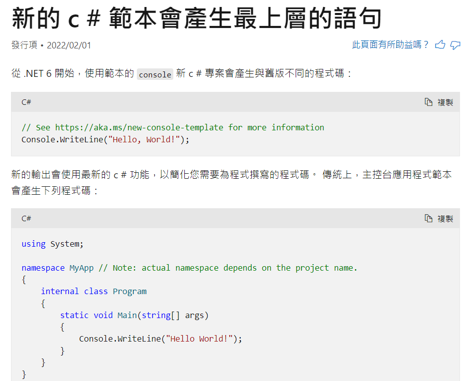
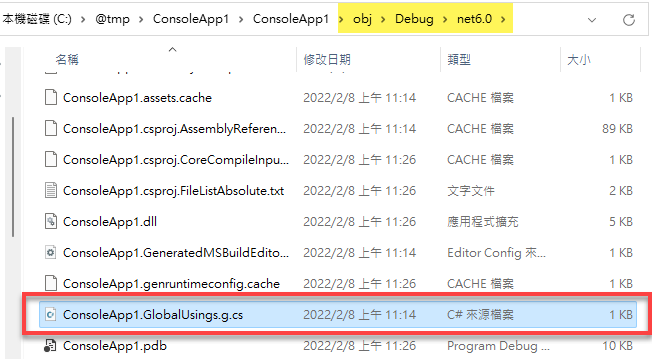

# C# 10

本章要介紹的是 C# 10 的新增語法和改進之處，包括：

- [其他改進](#其他改進)

**注意**：.NET 6 或更新的版本才有支援 C# 10。本章若有提及 Visual Studio，皆是指 Visual Studio 2022。
 
---

## File-scoped 命名空間

C# 10 新增了 file-scoped namespace 語法，中文譯作「檔案範圍的命名空間宣告」。往後提及此語法時，大多會使用英文 file-scoped。

File-scoped 命名空間宣告只要寫一行，就可以讓整個檔案裡面的型別全都隸屬在指定的命名空間裡。光用白話解釋恐怕不好理解，看程式碼會更清楚。以往都是以一對大括號來界定一個命名空間的有效範圍，例如：

~~~~~~~~csharp
namespace Models
{
    class Employee {  }
    class Customer {  }
}
~~~~~~~~

在 C# 10 可以這樣寫：

~~~~~~~~csharp
namespace Models;  // 宣告整個檔案範圍的命名空間

class Employee {  }  
class Customer {  }
~~~~~~~~

顯而易見，這個 file-scoped 命名空間語法的好處是可以讓我們的程式碼減少一層縮排。

Visual Studio 編輯器的預設值是「Block scoped」。你可以為 solution 加入一個 EditorConfig 檔案，並將其中的「namespace declarations」設定改為「File scoped」。如此一來，以後在此專案中新加入的 C# 檔案，其命名空間就會是 file-scoped 寫法。設定 EditorConfig 檔案的操作步驟可參考下圖（GIF 動畫）：

## 全域引用

當我們在 Visual Studio 中建立一個新的 Console 應用程式專案，目標框架選擇 .NET 6，並採用預設的專案名稱 ConsoleApp1，專案建立完成後，可以看到 Program.cs 檔案裡面只有一行程式碼，外加一行註解：
 
    // See https://aka.ms/new-console-template for more information
    Console.WriteLine("Hello, World!");

如果點開註解當中的那條網址，會帶我們到一份[微軟文件](https://aka.ms/new-console-template)，而該文件的中文版標題是「新的 C# 範本會產生最上層的語句」，如下圖：
 

 
如果你還沒有在專案中使用 C# 10 新增的 using 語法，不妨把那篇文章從頭到尾瀏覽一遍，以大致了解有哪些方便的 using 語法。底下僅整理幾個重點，希望有助於快速掌握其用法。
 
首先，程式裡面直接寫 `Console.WriteLine(...)` 而沒有 `using System` 命名空間，這是使用了 .NET 6 的「隱含引用」（implicit using）功能。那麼，這些隱含引用的命名空間是隱藏在哪裡呢？

當專案編譯之後，我們可以在專案目錄下的「obj\Debug\目標框架\」目錄下找到隱含引用的檔案，名稱是 [專案名稱].GlobalUsings.g.cs。如下圖：
 

 
開啟這個 .GlobalUsings.g.cs 檔案，其內容如下：
 
    // <auto-generated/>
    global using global::System;
    global using global::System.Collections.Generic;
    global using global::System.IO;
    global using global::System.Linq;
    global using global::System.Net.Http;
    global using global::System.Threading;
    global using global::System.Threading.Tasks;

每行程式碼開頭的 `global using` 是 C# 10 新增的全域引用語法，而上面的程式片段裡面總共有七個全域引用的命名空間，這表示不僅 `Console` 類別，包含 `File`、`HttpClient`、`Thread` 等類別也都不用在其他 .cs 檔案中引用對應的命名空間，即可直接使用。如此一來，便可節省一些重複打字的時間。

值得一提的是，上列程式碼片段中的 `global::` 指示詞是在告訴編譯器：其後面跟著的命名空間是全域（最上層）的命名空間，請不要解析成特定命名空間底下的子命名空間。這個指示詞並非必要，但如果碰到命名空間衝突的情形，便可以使用命名空間別名辨識符號 `::` 來解決。

剛才展示的程式片段是來自預設的 Console 專案模板，如果是其他類型的專案模板，則會看到不同的內容。例如底下是建立 Blazor Server 專案時自動產生的 .GlobalUsings.g.cs 檔案的內容：

~~~~
// <auto-generated/>
global using global::Microsoft.AspNetCore.Builder;
global using global::Microsoft.AspNetCore.Hosting;
global using global::Microsoft.AspNetCore.Http;
global using global::Microsoft.AspNetCore.Routing;
global using global::Microsoft.Extensions.Configuration;
global using global::Microsoft.Extensions.DependencyInjection;
global using global::Microsoft.Extensions.Hosting;
global using global::Microsoft.Extensions.Logging;
global using global::System;
global using global::System.Collections.Generic;
global using global::System.IO;
global using global::System.Linq;
global using global::System.Net.Http;
global using global::System.Net.Http.Json;
global using global::System.Threading;
global using global::System.Threading.Tasks;
~~~~
 
現在我們知道了，原來隱含引用這項功能，背後其實使用了一種叫做 `global using` 的語法。那麼，我們當然也可以在自己的專案裡面「明白地」撰寫這些「隱含的」using 了。
 
### global using 語法
 
`global using`（全域引用）是 C# 10 新增的語法，其用途是將指定的命名空間套用於整個專案。換言之，A 專案裡面的 `global using` 指示詞不會影響到 B 專案或其他專案。
 
前面提到的那篇微軟文章裡面說，可以在 .csproj 裡面使用 `<ItemGroup>` 元素來增加或移除全域的命名空間。底下是一個範例：
 
~~~~
<Project Sdk="Microsoft.NET.Sdk">
    <PropertyGroup>
        <OutputType>Exe</OutputType>
        <TargetFramework>net6.0</TargetFramework>
        <ImplicitUsings>enable</ImplicitUsings>
        <Nullable>enable</Nullable>
    </PropertyGroup>
    
    <ItemGroup>
      <Using Include="MyLib.Extensions" />
      <Using Remove="System.Net.Http" />
    </ItemGroup>    
</Project>
~~~~
 
如果不喜歡在 .csproj 裡面管理全域命名空間，我們也可以用一個 C# 檔案來管理。接著說明具體作法。
 
首先，把 .csproj 檔案中的 `<ImplicitUsings>enable</ImplicitUsings>` 整行刪除，或將其屬性值改為 disable。也就是說，不要使用 Visual Studio 專案範本所提供的那些預設的全域命名空間。順便提及，將此功能關閉，並不會影響前面範例中的 `<ItemGroup>` 區塊裡面的 `Using` 設定。
 
接著在專案中加入一個 C# 檔案，通常命名為 GlobalUsings.cs。然後只要在這個檔案裡面使用 `global using` 來加入你想要套用至整個專案的命名空間就行了。參考下圖：

### 結語
 
我不喜歡在 .csproj 檔案裡面編輯 XML 標籤，所以比較偏好使用一個 C# 檔案來管理整個專案的 `global using` 語句。如此一來，如果發現命名空間衝突，或者有任何疑慮時，只要打開我建立的那個 GlobalUsings.cs 檔案，便可一目瞭然。
 
## 匿名型別的非破壞式變形

non-destructive mutation for anonymous types

## 分解式的新語法

## 結構的改進

欄位初始設定式
無參數建構式

## 記錄的改進

記錄（record）是從 C# 9 開始提供，而 C# 10 有兩處強化：

1. 宣告記錄類型時，可明確指定以結構（struct）作為真實型別。
2. 在記錄中改寫（override） `ToString` 方法時，可將其密封（sealed），以避免其他人——尤其是編譯器——改寫此方法。

接著對此兩處強化功能進一步說明。

> 以下內容需要對 `record` 有基本的認識才比較好理解。可參閱 [C# 9 的〈記錄〉](https://github.com/huanlin/LearningNotes/blob/main/csharp9/_post.md#%E8%A8%98%E9%8C%84)一節的說明。

### 以結構實作的記錄

記錄（record）類型是從 C# 9 開始提供，其編譯後的程式碼是以類別的形式存在，所以是參考型別。

C# 10 新增了 `record struct` 語法，讓我們能夠指定使用結構來作為實際型別。例如：

~~~~~~~~csharp
public record struct Point(int X, int Y);
~~~~~~~~

這裡使用了比較簡潔的「位置參數」語法來定義 `Point` 記錄。以此方式定義的記錄類型，實際上會被編譯成類似底下的程式碼：

~~~~~~~~csharp
public struct Point : IEquatable<Point>
{
	public int X { get; set; }
	public int Y { get; set; }
    ... 其餘省略
}
~~~~~~~~

**觀察重點 1**：此記錄類型是以結構來實現（第 1 行），所以它是個實質型別，而非參考型別。換言之，它也會有實質型別的限制，例如不支援繼承。

**觀察重點 2**：以位置參數語法來定義的記錄，編譯器會自動產生對應的屬性；這些屬性並非唯讀，而是可以隨時修改的，如第 3～4 行的屬性 X 與 Y。這是 `record struct` 和單純宣告 `record` 的一個主要差異。

如果基於某些原因而必須使用 `record struct`，同時又希望整個結構是唯讀的，此時有兩種作法，一個是在宣告時加上 `readonly` 關鍵字：

~~~~~~~~csharp
public readonly record struct Point(int X, int Y);
~~~~~~~~

另一種作法是改用一對大括號的寫法，以便我們可以更細緻地去設計每個屬性的行為：

~~~~~~~~csharp
public record struct Point
{
    public int X { get; init; }
    public int Y { get; init; }
}
~~~~~~~~

如此一來，`X` 和 `Y` 便是 [init-only 屬性](https://github.com/huanlin/LearningNotes/blob/main/csharp9/_post.md#Init-only-Setter)，亦即只能在物件初始化的過程中賦值，隨後無法再修改其值。

### `ToString` 方法可被密封

**基礎知識**：編譯器會幫我們自訂的 `record` 型別安插許多程式碼，其中包括[改寫的 `ToString` 方法](https://github.com/huanlin/LearningNotes/blob/main/csharp9/_post.md#tostring-%E6%96%B9%E6%B3%95)。

然而，當我們有多個自訂的記錄類型，彼此之間有好幾層繼承關係時，編譯器提供的這項功能卻反倒會出問題：位於繼承階層頂端的基礎型別如果想要把 `ToString` 的輸出結果固定下來，不讓後代亂改，這在 C# 9 是辦不到的，因為編譯器總是會替子代記錄改寫 `ToString` 方法。

於是有人想到，何不在基礎型別裡面加上 `sealed` 修飾詞來禁止後代修改呢？像這樣：

~~~~~~~~csharp
abstract record Point(int X, int Y)
{
    public sealed override string ToString() // C# 9: Error!
    {
        return $"({X},{Y})";
    }
}
~~~~~~~~

在 C# 9，第 3 行無法通過編譯。錯誤訊息是：

> Error CS8773:	Feature 'sealed ToString in record' is not available in C# 9.0. 

到了 C# 10，上列程式碼便可以通過編譯，而且更重要的是：可以防止他人（特別是編譯器）改寫父代記錄的方法。

> 實作此功能的 Thomas Levesque 曾在某個討論串中說：「this feature isn't really to prevent a user from overriding the method, but to prevent the compiler from doing so.」

## 巢狀屬性樣式 nested property patterns

## CallerArgumentExpression

## 其他新功能

---

～END～

⬆️[回頂端](https://github.com/huanlin/LearningNotes/blob/main/csharp10/_post.md#c-10)
↩️[回首頁](https://github.com/huanlin/LearningNotes#readme)
