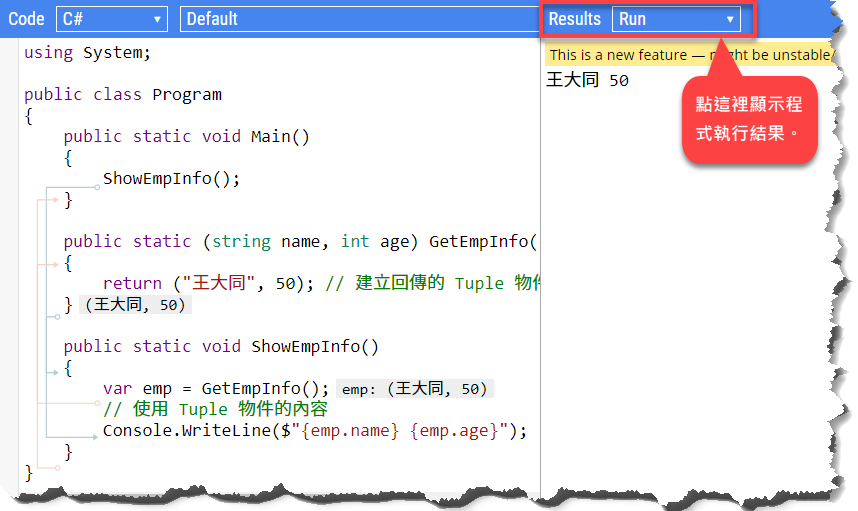
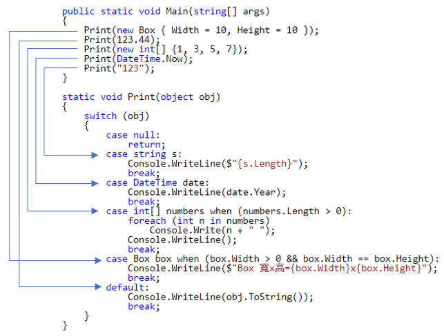
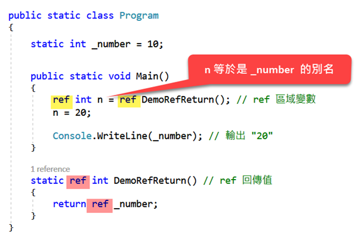

# C# 7 

本章要介紹的是 C# 7.0 至 7.3 的新增語法和改進之處。條列如下：

- [宣告輸出變數](#宣告輸出變數) 
- [Tuple 語法](#Tuple-語法) 
- [Tuple 元素名稱推導](#Tuple-元素名稱推導)
- [分解式（deconstructor）](#分解式（deconstructor）)
- [模式匹配](#模式匹配)
  - [`is` 陳述式]
  - [`switch` 陳述式]
- [區域函式](#區域函式)
- [更好讀的數值表示法（literals）](#更好讀的數值表示法（literals）)
- [Ref Local 與 Ref Return](#Ref-Local-與-Ref-Return)
- [`throw` 運算式](#throw-運算式)
- [`async Main` 方法](#async-Main-方法) 
- [`default` 運算式](#default-運算式)
- [實質型別的參考語意](#實質型別的參考語意) 
  - [`in` 參數]
  - [唯讀結構]
  - [只能放在堆疊的結構（ref struct）]
- [非後置的具名引數](#非後置的具名引數)
- [`private protected` 修飾詞](#private-protected-修飾詞) 
- [expression-bodied members 的改進](#expression-bodied-members-的改進)

---

## 宣告輸出變數

以往在呼叫一個具有輸出引數的函式時，必須事先宣告輸出變數，例如：

~~~~~~~~csharp
int num;  // 事先宣告變數
if (int.TryParse("100", out num))
{
   // (略)
}
~~~~~~~~

在 C# 7，呼叫函式的時候可以一併宣告輸出變數：

~~~~~~~~csharp
// 呼叫函式時直接宣告輸出變數
if (int.TryParse("100", out int num))
{
   // (略)
}
Console.WriteLine(num);
~~~~~~~~

以此方式宣告的輸出變數，於它所在的區塊範圍內皆可存取。因此，如果上例的轉換操作失敗，最後一行的輸出結果會是變數 `num` 的預設值，也就是 `0`。

> 範例原始碼：<https://dotnetfiddle.net/sNeemR>

## Tuple 語法

如果你對 tuple 這個名詞感到陌生，不妨把它想成是一個袋子。你可以把各式各樣的物品全都裝進這個袋子，方便四處帶著走。Tuple 像個單純的容器，沒有其他特別的操作或行為——它的主要用途就是拿來裝資料、交換資料。

那麼，什麼時候會用到 tuple 呢？一個典型的場景是當我們需要讓一個函式有多個回傳值。

C# 函式如果要有多個回傳值，大抵離不開以下幾種作法：

- 使用輸出參數。
  亦即透過參數列的 `out` 修飾詞來定義輸出參數。`out` 參數雖然方便，但某些場合無法使用，例如宣告為 `async` 的非同步方法就無法使用 `out` 參數。
- 傳回一個 `dynamic` 物件。
  此作法的缺點是效能較差，而且沒有編譯時期的型別安全檢查。
- 使用自訂型別。
  亦即寫一個新類別，把要返回的多項資訊包在這個類別裡面，然後讓函式返回這個自訂類別的物件。
- 使用 .NET 現成的 [`System.Tuple`](https://msdn.microsoft.com/zh-tw/library/system.tuple.aspx)。

如果只是比較簡單、或者用完即丟的場合，其實就沒必要寫一個新類別，而可以選擇 .NET Framework 提供的 `System.Tuple` 類別。底下示範此類別的基本用法：

~~~~~~~~csharp
public Tuple<string, int> GetEmpInfo()  // 指定回傳型別
{
    // 建立回傳的 Tuple 物件
    return new Tuple<string, int>("王大同", 50);
}

public void ShowEmpInfo()
{
    var emp = GetEmpInfo();
    // 使用 Tuple 物件的內容
    Console.WriteLine($"{emp.Item1} {emp.Item2}"); // "王大同 50"
}
~~~~~~~~

> 原始碼：<https://dotnetfiddle.net/vA6fyo>

程式說明：

* 第 1 行：`GetEmpInfo` 方法傳回的是 `Tuple<T1, T2>`。
* 第 4 行：建立並傳回 `Tuple` 物件。這裡也可以寫成 `Tuple.Create("王大同", 50)`。

透過這個範例，可以看得出來 `Tuple` 的能讓我們把多個物件兜在一起，形成一個複合物件。此類別有多個泛型版本，方便我們建立內含多個元素的 `Tuple` 物件：

~~~~~~~~
Tuple(T1)
Tuple(T1, T2)
Tuple(T1, T2, T3)
Tuple(T1, T2, T3, T4)
Tuple(T1, T2, T3, T4, T5)
Tuple(T1, T2, T3, T4, T5, T6)
Tuple(T1, T2, T3, T4, T5, T6, T7)
Tuple(T1, T2, T3, T4, T5, T6, T7, TRest)
~~~~~~~~

`Tuple` 類別有個明顯的缺點：我們必須以 `Item1`、`Item2`...`ItemN` 的方式來取得其內部元素（沒有 `Item0`）。也就是說，無法用有意義的名稱來存取其內部元素，這種寫法實在稱不上易讀易懂。於是，C# 7 在這方面提供了更簡明的語法。剛才的範例可用 C# 7 的 tuple 語法改寫如下：

~~~~~~~~csharp
// public Tuple<string, int> GetEmpInfo()  // 指定回傳型別~~
public (string name, int age) GetEmpInfo() // C# 7
{
    // 建立回傳的 Tuple 物件
//  return Tuple.Create("王大同", 50);
    return ("王大同", 50);
}

public void ShowEmpInfo()
{
    var emp = GetEmpInfo();
    // 使用 Tuple 物件的內容
//  Console.WriteLine($"{emp.Item1} {emp.Item2}");
    Console.WriteLine($"{emp.name} {emp.age}"); // "王大同 50"
}
~~~~~~~~

跟先前的版本比起來，有三個地方不一樣：

 * 在宣告函式的回傳型別時（第 2 行），語法已經能夠像參數列那樣指定參數的名稱。這裡使用的是 C# 7 的 **tuple type** 語法。
 * 建立 tuple 物件的寫法更簡單（第 6 行）。這裡不是用 `new` 來建立物件，而是 C# 7 的 **tuple literal** 語法。
 * 可直接用名稱來存取 tuple 的內部元素（倒數第 2 行）。

> 範例程式：<https://dotnetfiddle.net/9Hv9PZ>
>
> 若 .NET Fiddle 無法編譯本節的範例程式，你也可以將程式碼貼到 <https://sharplab.io>，如下圖：
>
> 

另外要知道的是，C# 7 的 tuple 語法並非使用 `System.Tuple` 類別，而是新的 `System.ValueTuple`；前者是參考型別，後者是個結構，亦即實質型別。而且，`ValueTuple` 存在於 `System.ValueTuple.dll`，是 .NET Standard 的一部分，而且並未包含在較早版本的 .NET Framework 裡面。因此，使用 C# 7 的 tuple 語法時，你可能會需要透過 NuGet 來為專案加入 `System.ValueTuple` 套件。

### Tuple 元素名稱推導

C# 7.1 對 tuple 語法又有一些改進：能夠根據變數和屬性名稱來推導其元素名稱。先來看 C# 7.0 的寫法：

~~~~~~~~csharp
string name = "mike";
int age = 20;
var tuple = (Name: name, Age: age); // 明確指定元素名稱
Console.WriteLine($"{tuple.Name} {tuple.Age}");
~~~~~~~~

注意第 3 行在建立 tuple 物件時，明確指定了各個元素的名稱，以便後續能夠以名稱來存取 tuple 物件的內部元素。（若不指定元素名稱，第 4 行在存取元素時就只能用上一節提到的 `Item1`、`Item2` 了。）

到了 C# 7.1，由於具備自動推導元素名稱的能力，寫法可以更簡潔：

~~~~~~~~csharp
string name = "mike";
int age = 20;
var tuple = (name, age); // 自動推導元素名稱
Console.WriteLine($"{tuple.name} {tuple.age}");
~~~~~~~~

第 3 行在建立 tuple 物件的時候，會直接使用變數 `name` 和 `age` 的名稱來當作 tuple 內部的元素名稱。

> 如果用 C# 7.0 來編譯上列程式碼，第 3 行的寫法等於是採用不具名的元素，於是第 4 行會導致編譯錯誤。

稍早提過，C# 7 的 tuple 語法背後所使用的型別是 `System.ValueTuple` 結構。若您有興趣知道剛才的範例程式編譯之後的「長相」，它們大概會是：

~~~~~~~~csharp
string name = "mike";
int age = 20;
ValueTuple<string, int> tuple = new ValueTuple<string, int>(name, age);
Console.WriteLine($"{tuple.Item1} {tuple.Item2}");
~~~~~~~~

由此可所見，骨子裡，tuple 內部各元素的名稱仍然是 Item*N*。

### 無法推導元素名稱的情形

有兩種情況會無法推導元素的名稱：

* 元素名稱正好是某些保留字，例如 Item*N*、Rest、ToString 等等。
* 元素名稱重複。

請看以下範例：

~~~~~~~~csharp
int Year = 2018;
var today = DateTime.Now;
var tuple = (Year, today.Year);  
Console.WriteLine($"{tuple.Year}"); // 編譯失敗!
~~~~~~~~

第 3 行在建立 tuple 物件時，由於傳入的兩個元素都有 `Year`，編譯器就不會對它進行名稱推導。因此，第 4 行欲使用名稱 `Year` 來存取元素，便會因為沒有這個元素名稱而造成編譯錯誤。這裡要特別指出來，第 3 行的寫法雖然不會推導元素名稱，但仍可以通過編譯。像底下這個重複名稱的例子就會造成編譯錯誤了：

~~~~~~~~csharp
var tuple = (x: 1, x: 2); // 編譯失敗：名稱重複!
~~~~~~~~

### Tuple 與匿名方法

C# 7 的 tuple 語法越來越像匿名方法了。這裡用兩個 LINQ 陳述式來做個簡單的對照（LINQ 語法要到後面的章節才會介紹）。

首先是使用匿名方法的版本：

~~~~~~~~csharp
from emp in employees
select new { emp.Name, emp.Birthday };
~~~~~~~~

接著是使用 tuple 的版本：

~~~~~~~~csharp
from emp in employees
select (emp.Name, emp.Birthday);
~~~~~~~~

兩種寫法是不是很像呢？

由此可見，除了讓函式有多個回傳值，tuple 也很適合用於 LINQ 查詢。

然而，tuple 能夠完全取代匿名方法嗎？也不盡然。

~~~~~~~~csharp
// (1) 使用 Action<T1, T2, T3>
Action<string, int, bool> act1 = 
    (name, age, active) 
    => Console.WriteLine($"{name}, {age}, {active}");
act1("michael", 18, true);

// (2) 使用 Action<ValueTuple<T1, T2, T3>>
Action<(string, int, bool)> act2 = 
    (user) 
    => Console.WriteLine($"{user.Item1}, {user.Item2}, {user.Item3}");
act2(("michael", 18, true));
~~~~~~~~

(1) 和 (2) 兩種寫法在功能方面是等效的，可讀性則不同。試比較第 3 行和第 9 行，以及第 4 行和第 10 行的差異，便可以看得出來，存取 tuple 元素的時候仍得用 `Item1/2/3`... 的方式，就程式碼的可讀性而言並沒有比使用匿名方法好。

## 分解式

C# 7 新增了一種叫做「分解式」（deconstructor）的方法，方法名稱固定為 `Deconstruct`。一旦類別有提供此方法，它就具備了「將物件內的元素逐一分解至多個變數」的能力。我們先用一個 `Tuple` 範例來看看「分解」實際上指的是什麼。

> Deconstructor 很容易被看成是 destructor。前者是 C# 7 新增的分解方法，後者是所謂的「解構子」（解構函式）。

沿用上一節的範例，這次只是稍微修改先前的 `ShowEmpInfo()` 函式：

~~~~~~
void ShowEmpInfo()
{
    var emp = ("王大同", 50);     // tuple literal
    var (empName, empAge) = emp; // 分解式
    Console.WriteLine($"{empName} {empAge}"); // 王大同 50
}
~~~~~~

請看第 4 行，等號的右邊是一個 `Tuple` 物件。在等號的左邊，則使用了所謂的分解式宣告（deconstruction declaration）的語法。這行程式碼的作用是：把一個 `Tuple` 物件裡面的元素依序指派給等號左邊的括弧中宣告的變數。然後，我們就可以直接使用這些變數（第 5 行）。

現在讓我們來看看，如何讓自己設計的類別具備「分解」能力。

### 為類別加入分解式

先前提過，分解方法的名稱必須是 "**Deconstruct**"。此方法的回傳型別必須是 `void`，而它所分解出來的東西，則是透過輸出參數來提供給呼叫端。請看以下範例：

~~~~~~~~csharp
public class Box
{
    public int Width { get; }   // 唯讀的自動屬性
    public int Height { get; }  // 唯讀的自動屬性

    // 建構式（constructor）
    public Box(int width, int height)
    {
        Width = width;
        Height = height;
    }

    // 分解式（deconstructor）
    public void Deconstruct(out int width, out int height)
    {
        width = this.Width;
        height = this.Height;
    }

    // 請留意建構式和分解式兩者的相似與相異處；
    // 在設計類別時，你可能會想要同時提供這兩種方法。
}
~~~~~~~~

如此一來，類別 `Box` 就具備了將本身包含的資訊（寬與高）拆解成兩個 `int` 變數的能力。底下是應用例：

~~~~~~~~csharp
var box = new Box(20, 50);
var (width, height) = box; // 將 box 物件分解成兩個變數
Console.WriteLine($"寬={width}, 高={height}");
~~~~~~~~

其中第 2 行完成了兩件事：宣告兩個 `int` 變數（`width` 和 `height`），然後呼叫 `Box` 的 `Deconstruct` 方法來分別設定那兩個變數的初始值。

上例的分解式不一定要寫成一行，你也可以將物件分解至事先宣告的變數，像這樣：

~~~~~~~~csharp
int width;
int height;
(width, height) = box; // 將 box 物件分解成兩個變數
~~~~~~~~

> 範例程式：<https://dotnetfiddle.net/VKwB83>

一個類別可以有多個分解式，也就是多載方法（overloaded methods），像這樣：

~~~~~~~~csharp
public void Deconstruct(out int width, out int height)
{
    // (略)
}

public void Deconstruct(
    out int left, out int top, out int right, out int bottom)
{
    // (略)
}
~~~~~~~~

因此，當編譯器在決定使用哪一個版本的 `Deconstruct` 方法時，也是跟多載方法的解析規則相同（根據參數列來決定）。

既然與一般的方法宣告相同，那我們當然也可以直接呼叫它：

~~~~~~~~csharp
var box = new Box(20, 50);
box.Deconstruct(out int width, out int height);
// 上一行使用了本章稍早介紹過的 `out` 變數的宣告語法。
~~~~~~~~

另外，分解式也能寫成擴充方法，而不一定要寫在類別裡面。同樣用先前的範例，假設我們無法取得 `Box` 類別的原始碼，我們依然能透過擴充方法來為它提供分解式：

~~~~~~~~csharp
public static class BoxExtensions
{
    public static void Deconstruct(this Box box, out int width, out int height)
    {
        width = box.Width;
        height = box.Height;
    }
}
~~~~~~~~

如果類別本身已經提供了分解式，你又另外寫了相同 signature 的擴充方法，此時編譯器會選擇使用類別本身提供的分解式。

現在我們看得很清楚了：`Deconstruct` 方法與一般的 C# 方法沒有太大差異，只是方法名稱得按規定，不能隨便取。這裡要再特別指出的是，實際上會呼叫哪一個分解式，是在編譯時期就決定的，這表示 `dynamic` 變數無法使用物件的分解式。因此，底下的寫法無法通過編譯：

~~~~~~~~csharp
dynamic box = new Box(10, 10);
box.Deconstruct(out int width, out int height); // 編譯失敗!
~~~~~~~~

### 巢狀分解

C# 7 的分解式還支援巢狀分解。為了解釋這個稍稍複雜一點的語法，這裡仍沿用先前的例子，把 `Box` 類別改寫一下：

~~~~~~~~csharp
public class Box
{
    public int Width { get; }
    public int Height { get; }

    public Box(int width, int height)
    {
        Width = width;
        Height = height;
    }

    // 一號分解式
    public void Deconstruct(out int width, out int height)
    {
        width = this.Width;
        height = this.Height;
    }

    // 二號分解式
    public void Deconstruct(out int width, out int height, out Box box)
    {
        width = this.Width;
        height = this.Height;
        box = new Box(width / 2, height / 2); // 內盒是外盒的一半大小
    }
}
~~~~~~~~

現在 `Box` 類別的分解式有兩個多載版本，而新加入的分解式（註解標示「二號分解式」）允許傳入三個參數，這第三個參數的型別也是 `Box`（當然也可以是其他型別，這裡用現成的類別只是圖個方便）。

那麼，在應用時，可以這樣寫：

~~~~~~~~csharp
var box = new Box(20, 50);
var (width, height, (innerWidth, innerHeight)) = box; // 巢狀分解
Console.WriteLine($"內盒寬高 = {innerWidth} x {innerHeight}");
~~~~~~~~

其中的第 2 行做了兩次分解：

1. 分解 `var` 宣告的最外層括弧。我們可以用簡短代號，把它看成 `(w, h, (x))`，可能會比較好理解。也就是說，第一層括弧裡面有三個變數，因此這裡會先呼叫的是帶有三個參數的那個，也就是二號分解式：`Deconstruct(out int width, out int height)`。
2. 承上，`(w, h, (x))` 中的 `x` 還需要進一步拆解成兩個 `int` 變數，所以接著要再呼叫帶有兩個參數的分解式，即一號分解式：`Deconstruct(out int width, out int height)`。

> 原始碼：<https://dotnetfiddle.net/qUqCqZ>

在結束本節之前，讓我們快速回顧一下分解式（deconstructor）的幾個重點：

 - deconstructor 不是 destructor；deconstructor 的函式名稱是 `Deconstruct`。
 - deconstructor 不只能用來分解 `Tuple`；只要類別有提供合適的 `Deconstruct` 方法就可以分解。
 - `Deconstruct` 方法可以多載，也可以寫成擴充方法。由於是編譯時期進行方法解析，故 `dynamic` 變數無法使用 `Deconstruct` 方法（即無法通過編譯）。
 - 分解式可巢狀分解。範例：`var (x, (y, z)) = anObject;`

## 模式匹配

C# 7 增加了「模式匹配」（pattern matching）的語法，可用來判斷某個變數或陳述式的「長相」是否符合特定條件，以決定程式要走哪一條執行路徑——這樣說也許太抽象了，待會兒看到範例程式會比較清楚了。

C# 7 在模式匹配這個部分，目前支援 `is` 和 `switch` 陳述式。從微軟的技術文件來看，未來應該會在這方面繼續強化。接著就來看看這個新語法有何特別之處。

### 模式匹配之 `is` 陳述式

在 C# 7 之前，如果要判斷某變數是否是某種型別，常會使用 `is` 運算子：

~~~~~~~~csharp
void Print(object obj)
{
    if (obj == null)    // 若物件為空，便直接返回。
        return;
    if (obj is string)  // 若物件是個字串，就輸出字串長度。
    {
        var s = obj as string;
        Console.WriteLine($"{s.Length}");
    }
}
~~~~~~~~

C# 7 可以這樣寫：

~~~~~~~~csharp
void Print(object obj)
{
    if (obj is null)    // C# 7 OK；C# 6 編譯失敗
        return;
    if (obj is string s) // C# 7 OK；C# 6 編譯失敗
    {
        Console.WriteLine($"{s.Length}");
    }
}
~~~~~~~~

這裡有兩處改寫（註解中標示 C# 7 的地方）：

  - 第 3 行：判斷物件是否為 `null`，現在也可以用 `is` 了。儘管這算不上什麼大躍進，但的確提供了多一種選擇，讓我們可以一致地使用 `is` 來判斷物件的「長相」。

  - 第 5 行：這一行就完成了兩件事，即 (1) 判斷 `obj` 的型別是否為 `string`；(2) 將物件轉型並指派給新宣告的變數 `s`。

> 如果是判斷「不為 `null`」的場合，我還是比較喜歡寫成 `(obj != null)`，而不是 `(!(obj is null))`。當然這只是個人喜好的問題。

值得注意的是，以此方式宣告的區域變數，其有效存取範圍是「在外層包住它的那個區塊」。也就是說，底下的寫法完全沒有問題：

~~~~~~~~csharp
void Print(object obj)
{
    if (!(obj is string s))
        return;
    Console.WriteLine(s); // 這裡仍可使用變數 s。
}
~~~~~~~~

> 原始碼：<https://dotnetfiddle.net/ywmqtI>

### 模式匹配之 `switch` 陳述式

上一節的範例程式碼使用了兩個 `if` 陳述式，而一旦要判斷的條件很多，使用 `switch` 會比較好。而且，`switch` 陳述式還可以使用 `when` 子句來進一步提供其他條件。範例如下：

~~~~~~~~csharp
void Print(object obj)
{
    switch (obj)
    {
        case null:          // <1>
            return;
        case string s:      // <2>
            Console.WriteLine($"{s.Length}");
            break;
        case DateTime date: // <3>
            Console.WriteLine(date.Year);
            break;
        case int[] numbers when numbers.Length > 0: // <4>
            foreach (int n in numbers)
                Console.WriteLine(n);
            break;
        case Box box when (box.Width > 0) // <5>
            Console.WriteLine($"Box 寬x高={box.Width}x{box.Height}");
            break;
        default:
            Console.WriteLine(obj.ToString());
            break;
    }
}
~~~~~~~~

依註解中標示的編號說明：

1. 跟 `is` 一樣，在 `switch` 裡面也可以判斷變數是否為 `null`。
2. 若 `obj` 是 `string`，就轉型成 `string` 並指派至新宣告的變數 `s`。
3. 若 `obj` 是 `DateTime`，就轉型成 `DateTime` 並指派至新宣告的變數 `date`。
4. 這裡使用了 `when` 子句：只有當 `obj` 是個整數陣列，而且該陣列的長度大於零的時候，才會執行這個 `case` 區塊裡面的程式碼。
5. 只是再多一個 `when` 子句的例子，並沒有什麼特殊之處。

> 範例原始碼：<https://dotnetfiddle.net/uRct75>
>
> 下圖所示為此範例的程式執行路徑：
> 
> 

現在讓我們來看一個稍微特別的情況。底下的程式碼在執行時會進入哪一個 `case` 區塊？

~~~~~~~~csharp
string str = null;
switch (str)
{
    case string s:
        Console.WriteLine("字串");
        break;
    case null:
        Console.WriteLine("null");
        break;
}
~~~~~~~~

執行結果是輸出字串 "null"，也就是執行了第二個 `case` 區塊。這是因為，儘管表面上來看，`str` 的型別是 `string`，但骨子裡它什麼都不是；它是個 `null`。在判斷第一個 `case` 條件時，其作用等同於使用 `as` 轉型操作：

~~~~~~~~csharp
if ((null as string) != null) // 結果為 false。
{
    Console.WriteLine("字串");
}
~~~~~~~~

由於 `null` 無法轉型為其他型別，因此 `null as string` 的轉型仍為 `null`。於是，這個條件判斷式的結果為 `false`。

另外，底下是個錯誤示範：

~~~~~~~~csharp
switch (obj)
{
    case string s1:
        break;
    case string s2 when s2.Length > 5: // 編譯失敗!
        break;
}
~~~~~~~~

這是因為第一個 `case` 的條件涵蓋了第二個 `case`，亦即第二個 `case` 永遠不可能執行到。編譯器會幫你挑出這個有問題的寫法。

#### 支援泛型

C# 7.0 的模式匹配語法尚未支援泛型，無法編譯底下的程式碼：

~~~~~~~~csharp
public static void Draw<T>(T shape)
{
    switch (shape)
    {
        case Circle circle:  // C# 7.0 編譯失敗!
            Console.WriteLine("畫個圓");
            break;
        case Rectangle rect: // C# 7.0 編譯失敗!
            Console.WriteLine("畫個矩形");
            break;
    }
}
~~~~~~~~

到了 C# 7.1，上面的範例程式就能通過編譯了。

> 原始碼：http://bit.ly/csharp71pmgt

## 區域函式

有時候，程式寫著寫著，越來越長，為了容易閱讀與維護，我們會開始整理程式碼，找出比較長的函式，把其中一部分邏輯獨立出去，成為新方法；而且這些方法不會供外界使用，所以大多會將他們定義成類別的私有方法。這樣的結果，是類別裡面會有越來越多的私有方法，而且這些方法僅由特定一兩個函式使用，並非整個類別都會用到。

除了定義成私有方法，另一種可能的做法是使用 .NET 的 `Func` 或 `Action` 類別來建立匿名函式，像這樣：

~~~~~~~~csharp
void Foo()
{
    Func<int, int> square = (num) => num * num;
    Console.WriteLine(square(10));
}
~~~~~~~~

這讓程式碼看起來有那麼一點點區域函式的味道，但仍不夠直觀，而且更重要的是，這種作法可能會碰到匿名函式的一些先天上的限制，例如不可使用 `out`、`ref`、與 `params` 參數。

C# 7 新增了區域函式（local functions；或譯為「本地函式」）的語法，讓我們可以在任何函式裡面定義其他函式，正好能夠紓解上述問題。這裡說的「任何函式」，包括一般的方法、建構函式、以及屬性的 getter 與 setter。

> C# 編譯器會把區域函式編譯成類別的私有方法。

現在，讓我們來看一個例子：

~~~~~~~~csharp
void Foo()
{
    int Square(int num)
    {
        return num * num;
    }
    Console.WriteLine(Square(10));
}
~~~~~~~~

其中的 `Square()` 即為區域函式，只有其外層函式 `Foo()` 區塊範圍內的程式碼才能呼叫它。順便一提，此區域函式由於只有一行程式碼，故可使用本章稍早提過的 expression-bodied members 語法加以簡化：

~~~~~~~~csharp
void Foo()
{
    int Square(int num) => num * num;
    Console.WriteLine(Square(10));
}
~~~~~~~~

區域函式跟一般的函式寫法差別不大，比較特殊的是，區域函式不可宣告為 `static`。

### 捕捉區域變數

在區域函式裡面也能夠存取其外層函式的區域變數。一種常見的說法是用「捕捉」這個詞：區域函式能夠捕捉外層函式的區域變數。參考底下的範例：

~~~~~~~~csharp
void Foo()
{
    int sum = 0;
    int Add(int n)
    {
        sum += n;    // 存取外層函式的區域變數
        return sum;
    };

    Console.WriteLine(Add(10));  // 輸出 "10"
    Console.WriteLine(Add(10));  // 輸出 "20"
}
~~~~~~~~

> 原始碼：<https://dotnetfiddle.net/BFTkgJ>。

## 更好讀的數值表示法

C# 7.0 在數值（literals）方面的語法提供了兩項改進：

 * 二進制數值表示法。
 * 數字可以用分隔字元（底線：'_'）來增加可讀性。

在某些情況，使用十六進制或二進制來表示數值會更有意義。在 C# 7 之前已經可以用 `0x` 來代表十六進制的數值。C# 7 又新增了二進制表示法，使用的符號是 `0b`。參考以下範例：

~~~~~~~~csharp
int num1 = 0xf0f0;  // 十六進制。
int num2 = 0b1111000011110000;    // 二進制。
int num3 = 0b1111_0000_1111_0000; // 二進制，使用分隔字元。
int num4 = 61_680;                // 十進制，使用分隔字元。
Console.WriteLine($"{num1}, {num2}, {num3}, {num4}");
~~~~~~~~

此範例的四個變數的輸出結果都一樣是 61680。請注意 `num3` 和 `num4` 還使用了分隔字元 `_` 來增加可讀性。這也是 C# 7 新增的語法。

> 原始碼：<https://dotnetfiddle.net/psH1sD>

C# 7.2 在這個部分又有了些微改進。在此之前，分隔字元 `_` 不可以是常值的第一個字元，而此限制到了 C# 7.2 便解除了。請看以下範例：

~~~~~~~~csharp
int num = 0b_1111000011110000;   // C# 7.1 編譯失敗；C# 7.2 OK
~~~~~~~~

## Ref Local 與 Ref Return

自 C# 1.0 以來，`ref` 關鍵字僅只用於呼叫方法時，指名參數的傳遞方式為「傳址」（或者「傳參考」；passed by reference）。也就是說，有加上 `ref` 的參數，在方法中的任何改動都會反映至呼叫端對應的變數（因為加了 `ref` 的參數只是個指標，指向呼叫端的變數）。

如果您已經很熟悉「傳址」的用法，可以跳過下面這個範例。

~~~~~~
static void Main() 
{
    int x = 0;
    int y = 0;
    ChangePosition(ref x, ref y);    
    Console.WriteLine($"{x}, {y}"); // 輸出 "10, 20"
}

static void ChangePosition(ref int m, ref int n) 
{
    m = 10;
    n = 20;
}
~~~~~~

從 C# 7 開始，除了用來指出參數的傳遞方式，`ref` 關鍵字還可以用在兩個地方：區域變數、回傳值。這兩種用法有專屬的稱呼，分別是 **ref local**（ref 區域變數）和 **ref return**（ref 回傳值）。

### Ref Local

C# 7 增加的 ref local 語法可以讓我們給區域變數和類別的欄位取個別名（或建立「替身」，如果你看過《Jojo 冒險野狼》）。換言之，修改某變數的值，其內容會反映至另一個變數——包括實質型別（value types）。使用此語法時，通常會有兩個地方需要加上 `ref` 關鍵字：一是宣告用來當作別名的變數，另一個是指派變數值的時候，變數的左邊要加上 `ref`。如以下範例所示：

~~~~~~~~csharp
int origin = 0;
ref int alias = ref origin; // ref local 語法

alias = 20;
Console.WriteLine(origin); // 輸出 "20"

origin = 30;
Console.WriteLine(total); // 輸出 "30"
~~~~~~~~

由此範例可以看得出來，每當 `alias` 的值改變，`origin` 也跟著改變；反之亦然。

前面提過，ref 區域變數可以參考的對象還包括類別的欄位。當 ref local 指向物件欄位的時候，有個小細節可能需要說明一下。請看範例：

~~~~~~~~csharp
public static class Program
{
    public static void Main()
    {
        var obj = new Foo();
        ref int alias = ref obj.Number; 

        alias = 10;
        Console.WriteLine(obj.Number); //  輸出 "10"

        obj = new Foo();
        Console.WriteLine(alias); // 輸出 "0" 還是 "10"？
    }
}

public class Foo
{
    public int Number = 0;
}
~~~~~~~~

> 原始碼：<https://dotnetfiddle.net/pXQpWw>

範例程式的第 6 行令變數 `alias` 指向另一個物件的欄位（`obj.Number`），接著改變 `alias` 的值，然後在螢幕上輸出 `obj.Number` 的值。這裡毫無懸念，輸出的結果是 "10"。那麼，第 11 行讓 `obj` 指向另一個新建立的物件之後，`alias` 會是指向先前那個物件的 `Number` 欄位，還是新物件的？

答案是原先那個物件的欄位。因為 ref 區域變數只是個指標而已，它會一直指向當初指派給它的那個欄位（除非你重新指派別的欄位給它，這個部分稍後就會提到）。因此，第 12 行印出 `alias` 的結果是 "10"。

實務上，是否會經常需要使用 ref local 語法來建立變數的別名？機會可能不多吧。比較可能的用法是搭配 ref return 語法。

### Ref Return

如您所熟知的，有加上 `ref` 的參數，在方法中的任何改動都會反映至呼叫端對應的變數；而 C# 7 的 ref return 語法，則正好是相反的方向——它可以讓我們把某個方法中的區域變數以傳址的方式回傳給呼叫端。

在使用 ref return 語法時，`ref` 關鍵字必須成對出現：

 - 在宣告方法的回傳值的型別之前要加上 `ref`；
 - 在返回呼叫端的時候，`return` 關鍵字和變數名稱之間要加上 `ref`。

參考下圖的範例：

> 原始碼：<https://dotnetfiddle.net/HMs17W> （註：撰寫本章時，.NET Fiddle 尚未支援此語法。您可將程式碼貼到 Visual Studio 編輯器來查看執行結果。）

另外，你還可以這樣寫：

~~~~~~~~csharp
public static class Program
{
    static int _number = 0;

    public static void Main()
    {
        RefReturn(ref _number)++; // 注意這行的寫法！
        Console.WriteLine(_number); // 輸出 "1"
    }

    static ref int RefReturn(ref int x) => ref x;
}
~~~~~~~~

第 7 行的作用等同於直接對 `_number` 做遞增運算。實務上不見得會需要這樣寫，不過，多了解一點也無妨。也許哪一天你在 review 別人的程式碼時看到類似的寫法，就不至於太訝異了。

### 重新指派 Ref Local

在 C# 7.0 推出 ref local 語法時，ref 區域變數一經指派，就不能透過重新指派來讓它參考至其他變數，例如：

~~~~~~~~csharp
static int _number1 = 1;
static int _number2 = 2;

public static void Main()
{
    ref int x = ref _number1;
    x = ref _number2; // C# 7.0 編譯失敗； C# 7.3 OK
}
~~~~~~~~

第 7 行重新指派了 ref 區域變數 `x`，使其參考至另一個變數。這在 C# 7.0 是不允許的，到了 C# 7.3 則解除了這項限制。

### 用在哪裡？

那麼，ref local 和 ref return 究竟何時會用到呢？

一個主要的適用場合是：需要傳遞大型的結構（struct）。透過 ref local 和 ref return，我們可以避免對一個大結構進行所有欄位和屬性的複製操作，從而提升效能、並節省記憶體空間。

另一個可能的用途，是撰寫工具函式來傳回集合或陣列當中的某個元素的參考，而且元素的類型是實質型別。請看以下範例：

~~~~~~~~csharp
public static void Main()
{
    int[] numbers = { 1, 3, 5, 7, 9 };

    ref int x = ref FindX(numbers);
    x = 0;
    Console.WriteLine(String.Join(",", numbers)); 
}

static ref int FindX(int[] arr) => ref arr[2];
~~~~~~~~

此範例的執行結果為 "1,3,0,7,9"。

其中第 5 行和第 6 行甚至可以簡化成一行：

~~~~~~~~csharp
FindX(numbers) = 0;
~~~~~~~~

希望上述說明與範例能讓讓你產生一些靈感，發現更多可能的應用場合。

### Ref 條件運算式

C# 7.0 的 ref local 語法，在撰寫條件運算式的時候，會碰到一些限制。請看範例：

~~~~~~~~csharp
// 計算串列中的男生和女生數量，並以 tuple 傳回。
static (int boys, int girls) CountBoysAndGirls(List<bool> genders)
{
    var result = (boys: 0, girls: 0); // 建立 tuple
    foreach (var gender in genders)
    {
        ref int count = ref (gender ? ref result.boys : ref result.girls);
        // 此時 count 指向 result 裡面的 boys 或 girls。
        count++;  
        
    }
    return result;
}
~~~~~~~~

> 原始碼：<https://dotnetfiddle.net/gKEN3t> 

第 7 行的寫法在 C# 7.0 無法通過編譯，直到 C# 7.2 開始支援「ref 條件運算式」語法，便解決了這個問題。

### Ref readonly

C# 7.0 的 ref local 和 ref return 語法並沒有辦法禁止修改變數值，直到 C# 7.2 加入了 `ref readonly` 語法，讓我們可以為 ref 區域變數和 ref 回傳值加上 `readonly` 修飾詞，以防止變數值被修改。

如果對某方法的 ref 回傳值加上 `readonly`，則：

* 呼叫端也必須用一個唯讀的 ref 區域變數來承接該方法的回傳值。
* 呼叫端無法修改那個回傳值。

參考以下範例：

~~~~~~~~csharp
public static class Program
{
    public static void Main()
    {
        var obj = new Foo();

        ref var alias = ref obj.CreationTime;
        alias = DateTime.Now;   // OK

        ref readonly var alias2 = ref obj.GetCreationTime();
        alias2 = DateTime.Now;  // 編譯錯誤!
    }      

}

public class Foo
{
    public DateTime CreationTime = DateTime.Now;

    public ref readonly DateTime GetCreationTime() => ref CreationTime;
}
~~~~~~~~

> 原始碼：<https://dotnetfiddle.net/2Y8Rsw> 

說明：

* 第 7 行的 `alias` 變數是個 ref 區域變數，它指向物件的欄位，故可修改其值。
* 第 10 行的 `alias2` 是個 ref 唯讀區域變數，所以第 11 行嘗試修改其變數值會導致編譯錯誤。

## `throw` 運算式

當我們需要在程式中拋出例外（exception）時，是用關鍵字 `throw`，例如：

~~~~~~~~csharp
throw new FileNotFoundException();
~~~~~~~~

這是一個「throw 陳述式（statement）」，相信你已經非常熟悉。不過，在 C# 7 之前，這樣的陳述式不能與某些運算式搭配使用。例如：

~~~~~~~~csharp
bool? loaded = LoadMyFile();
var result = loaded ?? throw new InvalidOperationException("檔案載入失敗!");
~~~~~~~~

第 2 行程式碼在 C# 6 時代無法通過編譯，到了 C# 7 則沒有問題。這個改良語法叫做「throw 運算式（expression）」。

## `async Main` 方法

%% I> 如果您未曾使用 C# 非同步呼叫的語法，本節內容可能不太好懂，此時可閱讀 [第 10 章](#ch10) 以獲得更完整的說明。

在 C# 7.1 之前，如果為 `Main` 方法加上 `async` 修飾詞，編譯器就不會把它當作合法的程式進入點。也就是說，`Main` 方法不可以加上 `async`。可是，如果您已經熟悉 C# 的非同步呼叫語法，那您一定知道 `async` 和 `await` 是必須「一起出現」的，亦即沒有宣告 `async` 的方法，裡面就不能有 `await` 敘述。因此，底下這樣的寫法將無法通過編譯：

~~~~~~~~csharp
static int Main()
{
    return await DoMainTaskAsync(); // 編譯錯誤!
}

static async Task<int> DoMainTaskAsync()
{
    await Task.Delay(1000); 
    return 0;
}
~~~~~~~~

編譯器會告訴你第 3 行寫法有誤，原因是 `await` 關鍵字只能出現在有宣告 `async` 的方法中。用白話來說，就是：「只有宣告為 `async` 的非同步方法才能用 `await` 來等待其他非同步方法的執行結果。」

於是，我們只好這樣寫：

~~~~~~~~csharp
static int Main()
{
    // 以「同步等待」的方式來執行非同步方法。
    return DoMainTaskAsync().GetAwaiter().GetResult();
}
~~~~~~~~

從 C# 7.1 開始，`Main` 方法已經可以加上 `async` 了。於是我們終於可以從程式的進入點開始，一路 `async` 到底：

~~~~~~~~csharp
static async Task<int> Main()
{
    var result = await DoMainTaskAsync();
    return (result ? 0 : 1);
}
~~~~~~~~

如果 `Main` 不需要回傳值（即應用程式不用傳回結束碼），則回傳值可單純宣告為 `Task`：

~~~~~~~~csharp
static async Task Main()
{
    await DoMainTaskAsync();
}
~~~~~~~~

## `default` 運算式

在 C# 7.1 之前，如欲使用 `default` 關鍵字來取得某型別的預設值，就必須明白指定型別。像這樣：

~~~~~~~~csharp
int i = default(int); // i = 0
~~~~~~~~csharp

到了 C# 7.1，則可以省略型別：

~~~~~~~~csharp
int i = default; // C# 7.0 編譯失敗；C# 7.1 OK
~~~~~~~~

回傳值也一樣適用：

~~~~~~~~csharp
int GetDefault()
{
    return default;  // C# 7.0 編譯失敗；C# 7.1 OK
}
~~~~~~~~

以下範例則是把 `default` 用在陣列的初始化：

~~~~~~~~csharp
var array1 = new[] { default, 20 };
var array2 = new[] { default, "mike" };
var array3 = new[] { default, new List<string>() };
~~~~~~~~

上面三行程式碼在 C# 7.0 都是不合法的，C# 7.1 則沒問題：編譯器能夠根據陣列中的其他元素來推測元素的型別，那麼自然也就能夠決定各個 `default` 運算式該使用哪個型別的預設值了。範例中的三個陣列，第 0 個元素值分別是 0、`null`、`null`。

### 用於泛型

在設計泛型的時候，如果需要設定參數型別的預設值，此時 `default` 運算式正好能派上用場：

~~~~~~~~csharp
public class MyList<T>
{
    private List<T> _list = new List<T>();
    
    public T Add() 
    {
        T item = default; // C# 7.0 編譯失敗；C# 7.1 OK
        _list.Add(item);
        return item;
    }
}
~~~~~~~~

在 C# 7.0 或更早的版本，第 7 行可以這樣寫：

~~~~~~~~csharp
T item = default(T); 
~~~~~~~~

%% https://docs.microsoft.com/zh-tw/dotnet/csharp/whats-new/csharp-7-2

## 實值型別具備參考語意

C# 7.2 新增了一些語法，讓實質型別也具備類似參考型別的用法。包括：

* `in` 參數
* 唯讀結構（`readonly struct`）
* 只能存在堆疊的結構（`ref struct`）

### in 參數

從 C# 7.2 開始，函式的參數除了可以加上 `ref` 和 `out` 修飾詞，還可以加上 `in`。當你為某個參數加上 `in` 修飾詞，即表明兩件事：

* 該參數是以「傳參考」（傳址）的方式傳遞。
* 該參數是唯讀的，亦即參數值不會在函式中改動。

> 口訣：`in` 就是 `readonly ref`。

底下是一個簡單的例子：

~~~~~~~~csharp
public static void Main()
{
    int i = 10;
    Print(i);    // 隱含傳址呼叫
    Print(in i); // 明確傳址呼叫
}
static void Print(in int num)
{
    num++; // 編譯錯誤!
    Console.WriteLine(num);
}
~~~~~~~~

第 4 行和第 5 行的作用完全相同，差別僅在於前者是隱含的傳址呼叫，後者則是以 `in` 明確指出變數 `i` 是以傳參考的方式傳遞，而且它的值不會被 `Print` 方法改變。

第 7 行在宣告方法時，為參數 `num` 加上了 `in` 修飾詞，表明它是個唯讀參數。

> 這是否意味著，我們只要瞄一眼函式的參數列就知道哪些參數在此方法中不會被改動？呃……可惜並不完全是這樣。這當中還有微妙之處需要留意，稍後會進一步解釋。

第 9 行無法通過編譯，原因正如剛才說的，以 `in` 修飾的引數是唯讀的。把第 9 行程式碼註解掉，編譯之後的程式碼會類似底下這樣（利用 SharpLib 觀察反組譯的結果）：

~~~~~~~~csharp
public static void Main()
{
    int num = 10;
    Print(ref num); 
    Print(ref num);
}

static void Print([In] [IsReadOnly] ref int num)
{
    Console.WriteLine(num);
}
~~~~~~~~

由此可見，呼叫 `Print` 方法時都是以傳參考的方式來傳遞 `num` 參數（第 4 和第 5 行），而在 `Print` 方法的參數列，則同時加上了 `[In] [IsReadOnly]` 特徵項（attribute）和 `ref` 修飾詞。

那麼，以 `in` 修飾的參數既然是唯讀的，為何編譯器要以傳參考、而非傳值的方式來傳遞參數呢？主要的考量還是效率。試想，當我們需要傳遞一個大型結構給某個函式時，以傳值的方式雖可確保呼叫端的結構內容不被函式影響，但是呼叫函式的時候會有複製結構的動作（要配置堆疊空間、以及花時間逐一複製結構成員）。另一方面，若以傳參考的方式傳遞結構（參數前面加上 `ref` 修飾詞），雖然免掉了複製結構的成本，卻又無法保證該函式不會改動結構的內容。有了 `in` 修飾詞，便解決了這個困境。

> 原始碼：<http://bit.ly/csharp72inparam>

剛才的範例，呼叫 `Print` 方法時當然也可以傳入一個常數，像這樣：

    Print(10);

對此情況，編譯器會在幫你宣告另一個區域變數，並且仍以傳遞 `in` 參數的方式把那個區域變數傳給 `Print` 方法。

現在讓我們來看一個微妙的狀況，同時也是寫程式時需要特別留意的：

~~~~~~~~csharp
public static void Main()
{
    int i = 10;
    Print(in i, () => i++);
}

static void Print(in int num, Action action)
{
    Console.WriteLine(num); // 輸出 "10"
    action();
    Console.WriteLine(num); // 輸出什麼？
}
~~~~~~~~

> 原始碼：<http://bit.ly/csharp72inparamtrap>

也許你會跟我一樣，第一次看到這個範例時，不太確定第 10 行輸出的結果到底是 "10" 還是 "11"。

前面提過，`in` 修飾詞可確保呼叫函式的時候，該函式不會修改參數值。然而，它並無法防止該函式以外的程式碼去修改參數值。就像剛才的範例，由於 `in` 參數是以傳參考的方式傳遞，引數 `num` 其實是指向呼叫端的變數 `i`；因此，當呼叫端的匿名函式把 `i` 遞增之後，`num` 的值自然也就跟 `i` 一樣是 11 了。

這也就表示，我們不能單憑方法參數列裡面有為參數加上 `in` 就認定該參數值在方法執行的過程中不被改動。

#### in 與多載方法

讀過前面的內容，你已經知道加上 `in` 修飾詞的參數其實就是標示了「唯讀」旗號的 `ref` 參數。因此，如果兩個多載方法的參數列宣告只有差在 `in` 和 `ref`，那麼編譯器會把它們當成相同的方法而報錯，例如：

~~~~~~~~csharp
static void Print(in int num) { }
static void Print(ref int num) { } // 編譯錯誤!
~~~~~~~~

以下兩個多載方法則可以通過編譯（對你來說，應該是毫無懸念吧）：

~~~~~~~~csharp
static void Print(int num) { }    // 方法 1
static void Print(in int num) { } // 方法 2
~~~~~~~~

上面的例子，兩個多載方法長得幾乎一模一樣，只差有沒有 `in` 關鍵字。那麼，在呼叫時如果沒有明確加上 `in` 關鍵字，編譯器會優先選擇「傳值」的版本，也就是「方法 1」，如下所示：

~~~~~~~~csharp
int i = 10;
Print(10);   // 呼叫方法 1
Print(i);    // 呼叫方法 1
Print(in i); // 呼叫方法 2
~~~~~~~~

> **小心版本相容性的問題**
>
> 使用 `in` 參數時，還有一個地方在實際應用時可能需要留意：新舊版本的相容性。
> 假設你開發了一個函式庫，並以 NuGet 套件的形式發布在網路上。小王發現了你的 1.0 版的套件，並且在他的專案中使用。後來，你決定修改某個函式，為其中一個參數加上 `in` 修飾詞，然後發布了 2.0 版。小王拿到了你的新版 DLL 檔案之後，若沒有重新編譯他的程式，而是直接把你的 2.0 版 DLL 覆蓋掉原本的 1.0 版 DLL，那麼小王的程式執行時會發生 `MissingMethodException`，因為原本的方法已經找不到了。

綜上所述，我們不難發現，`in` 參數雖有好處（效率），但使用時也還是需要知道如何避免製造陷阱。如果你寫程式時總是很謹慎、在意程式碼將來好不好維護，那麼以下建議對你可能有用：

* 只有當 `in` 參數能夠顯著改善應用程式效率時才使用。
* 設計函式庫時，盡量少在在公開方法中使用 `in`，而只在私有方法中使用 `in` 參數。這樣可以把可能遭遇的意外狀況控制在自己的程式碼範圍內。
* 不要倚賴隱含式 `in` 參數傳遞。也就是說，呼叫帶有 `in` 參數的方法時，一律明確加上 `in` 關鍵字。

### 唯讀結構

在 C# 7.2 之前，能夠加上 `readonly` 來宣告唯讀的，就只有欄位（fields）。到了 C# 7.2，可宣告成唯讀的東西變多了——除了先前介紹過的 `ref readonly` 區域變數和 `in` 參數，我們還可以宣告唯讀的結構。在介紹唯讀結構的語法之前，讓我們先來了解一下這個語法對我們有何用處。

就以大家熟知的 `DateTime` 來說吧，它是個結構，亦即實質型別（value type）；而且它有個特性：一旦設定初始值，往後就無法再更改其內容。這種特性，一般稱之為「不可變的」（immutable）。當一個物件具備此特性時，它的行為就比較容易預測——或者說，我們會比較安心，不用懷疑它會在某時某處被任意修改而產生無法預期的副作用。

在 C# 7.2 之前，如果要設計一個「不可變的」結構，我們得小心翼翼，確保每個欄位、屬性都是唯讀的。像底下這個範例就漏掉一個地方：

~~~~~~~~csharp
public struct Position 
{
	public int X { get; } // 唯讀屬性
	public int Y { get; set; } // 可讀可寫
    
	public Position(int x, int y)
    {
        X = x;
        Y = y;
    }
}
~~~~~~~~

`Position` 結構有兩個屬性：`X` 和 `Y`。在這裡，`X` 是唯讀屬性，而 `Y` 呢，本來想要讓它也是唯讀屬性，可是偏偏不小心寫了設定式（setter），這麼一來，`Position` 物件就不是「不可變的」了。如果你需要設計很多這樣的結構，而且結構裡面動輒多達數十個屬性，寫程式的時候就得要仔細檢查，確保每一個屬性都不開放外界修改。

從 C# 7.2 開始，只要在宣告結構時加上 `readonly` 修飾詞，編譯器就會幫你做好這些檢查工作，確保整個結構必定是唯讀的。所以剛才的範例只要改動一處即可：

~~~~~~~~csharp
public readonly struct Position // 改這行。
{
	public int X { get; } // 唯讀屬性
	public int Y { get; set; } // 編譯失敗!
    
	public Position(int x, int y)
    {
        X = x;
        Y = y;
    }
}
~~~~~~~~

只有第 1 行在宣告結構時加上了 `readonly`，表示這是個唯讀結構，這樣就行了。現在，因為編譯器知道這是個唯讀結構，所以第 4 行會發生編譯錯誤。

此外，唯讀屬性一經設定初始值，就不能再改，所以我們會把所有屬性的初始設定工作寫在建構函式裡（第 6～10 行）。

> 使用 `readonly struct` 來定義的唯讀結構可確保由以結構所建立的所有執行個體都是唯讀的、不可變的（immutable）。如果不需要這種「型別等級」的不可變性，我們當然還是可以不使用 `readonly struct`，而讓用戶端在建立結構時，自行決定要不要讓某個結構的執行個體具備不可變性。例如：
>
>     class Foo 
>     {
>         private readonly Position pos;
>         public Foo(int y) => pos.Y = y;
>     }

### 只能放在堆疊的結構（ref struct）

我們知道，使用 `class` 來宣告的型別是參考型別（reference types），而使用 `struct` 來宣告的型別則是實質型別（value types）。參考型別所使用的記憶體空間是所謂的「堆積」（heap），實質型別則會活在變數所宣告的區塊中；如果實質型別的變數是宣告在某個函式當中的區域變數或方法的傳入參數，那麼這些變數就會放在堆疊（stack）裡。例如：

~~~~~~~~csharp
struct Point 
{ 
    public int X, Y; 
}
...
void SomeMethod()
{
    Point p; // p 會存在堆疊中
}
~~~~~~~~

然而，如果實質型別的變數是宣告為類別的欄位，等於是參考型別當中包著實質型別，所以整個物件（包含其中的實質型別變數）都會放在堆積裡。

~~~~~~~~csharp
class MyClass
{
    Point p; // p 活在堆積裡，因為 MyClass 物件實體會配置於堆積。
}
~~~~~~~~

同樣地，內含某些結構的陣列也是放在堆積，把一個結構裝箱（boxing）成物件也會放到堆積。

從 C# 7.2 開始，你可以在宣告結構時，在前面加上 `ref` 修飾詞來確保該結構只能存在堆疊裡，而任何違反此規則的寫法都會出現編譯錯誤。例如：

~~~~~~~~csharp
ref struct RefPoint 
{ 
    public int X, Y; 
}

class MyClass 
{ 
    RefPoint P; // 編譯錯誤！
} 
...
var points = new RefPoint [100]; // 編譯錯誤！
~~~~~~~~

上面的例子應該很容易理解為什麼會無法編譯，但有些場合就沒有那麼直觀了。比如說，非同步方法裡面也不能使用 `ref struct`，因為編譯器會在背後建立隱藏的類別，而其物件實體便會配置於堆積；再者，非同步方法的執行過程中，也可能因為切換到不同的執行緒而跨越不同堆疊區塊。基於類似的理由，匿名函式與迭代器（iterator）在使用 `ref struct` 的時候也會有一些限制。此外，`ref struct` 不能出現在一般結構（非 `ref struct`）中，也不能實作任何介面——因為實作介面便有可能出現裝箱［boxing］的狀況，而裝箱後的物件是存在堆積。

聽起來頗有一些限制，那又為什麼要引進 `ref struct` 語法呢？答案是：為了 `Span<T>` 和 `ReadOnlySpan<T>` 結構；這兩種結構是為了改進效能而生，而後者只是 `Span<T>` 的唯讀版本。`Span<T>` 可用來儲存一串包含 T 類型的元素序列，而且這個序列是存放在一塊**連續的**記憶體空間。`Span<T>` 與 `ReadOnlySpan<T>` 都是宣告成 `ref struct`，所以只能放在堆疊裡。如果寫程式的時候碰到剛才提到的某些限制而無法使用 `Span<T>`，則可以考慮使用 `Memory<T>`。

最後，再看一個例子：

~~~~~~~~csharp
ref struct RefPoint 
{ 
    public int X, Y; 
}

class MyClass 
{ 
    RefPoint Point => default; // 編譯 OK！
} 
~~~~~~~~

此範例可以順利通過編譯，因為 `MyClass` 中的 `Point` 只是單純的 getter（讀取方法），而沒有在類別當中

## 非後置的具名引數

非後置的具名引數（non-trailing named arguments）指的是呼叫方法時，具名引數可以寫在位置引數（positional arguments）的前面。

在 C# 7.2 之前，呼叫方法時一旦使用了具名引數，那麼後續的引數也都必須具名。C# 7.2 則解除了這個限制。直接看範例會比較清楚：

~~~~~~~~csharp
public static void Main()
{
    Print("mike", 20);            // 皆使用位置引數，OK!
    Print(age: 20, name: "mike"); // 皆使用具名引數，OK!
    Print(name: "mike", 20); // C# 7.1 編譯失敗；C# 7.2 OK
    Print(age: 20, "mike");  // 無論哪個 C# 版本都編譯失敗!
}

static void Print(string name, int age) { /*略*/ }
~~~~~~~~

注意第三個方法呼叫（第 5 行），第一個引數是採用具名引數，第二個引數則不具名（即位置引數）。由於第一個引數不僅具名，而且順序也正確（符合方法宣告的引數位置），所以編譯器能夠斷定我們的意圖是要把 20 傳遞給 `age` 參數。

至於最後一個方法呼叫（第 6 行），同樣也混用了具名引數和位置引數，可是具名引數 `age` 的位置不對（不符合方法宣告的引數順序），所以編譯器無法斷定剩下的非具名引數該對應到哪個參數。

## `private protected` 修飾詞

如你所熟悉的，存取範圍修飾詞有 `private`、`protected`、`internal`、`public` 四種。其中 `protected` 和 `interal` 又可以混搭套用在類別的成員，表示「類別本身與與其子類別」或者「同一組件（assembly）中的所有類別」皆可存取該成員。例如：

~~~~~~~~csharp
protected internal void Print() { }
~~~~~~~~

C# 7.2 又增加了一種組合：`private protected`。這種組合可用來限制類別成員僅能讓「類別本身」或者「與其同一組件內的子類別」來存取。參考以下範例：

~~~~~~~~csharp
public class Shape
{
    protected internal void Draw1() { }
    private protected void Draw2() { } // C# 7.2
}

public class Circle : Shape
{
    public void Draw()
    {
        var shape = new Shape();
        shape.Draw1();  // OK
        shape.Draw2();  // 編譯錯誤!

        Draw1();  // 存取父類別的成員, OK
        Draw2();  // 存取父類別的成員, OK
    }
}
~~~~~~~~

說明：

* 第 5～6 行分別定義了兩個用來畫出某種形狀的方法（請別在意其實務面的合理性），而且兩個方法使用了不同的存取範圍修飾詞。
* 第 17 行和第 20 行都沒問題，因為類別 `Circle` 跟 `Shape` 是在同一個組件裡，而且 `Draw1()` 允許子類別存取。
* 第 18 行無法通過編譯，因為 `Draw2()` 並沒有對外開放。
* 第 21 行沒問題，因為 `Draw2()` 可讓子類別存取。

> 原始碼：<http://bit.ly/csharp72pripro>

如果把類別 `Circle` 移到另一個組件，那麼上面的範例就只剩下第 20 行對父類別的 `Draw1()` 呼叫能夠通過編譯，其他三個呼叫都會產生編譯錯誤。

## Expression-bodied Members 的改進

C# 6 的 expression-bodied members 語法有一些限制。底下是無法使用此語法的場合：

 - 建構子（包括類別的靜態建構子）
 - 解構子（finalizer）
 - 唯寫（write-only）或者可讀寫的屬性
 - 唯寫或者可讀寫的索引子
 - 事件

C# 7 解除了上述限制。因此，以下範例在 C# 7 都是合法的陳述式：

~~~~~~~~csharp
public class Student
{
    private string _name;
    private readonly int[] _scores = new int[10];

    // 靜態建構子與物件的建構子
    static Student() => Console.WriteLine("靜態建構子被呼叫了。");
    public Student(string name) => _name = name;

    // 可讀寫的屬性
    public string Name
    {
        get => name;
        set => name = value;
    }

    // 可讀寫的索引子
    public int this[int index]
    {
        get => values[index];
        set => values[index] = value;
    }

    // 事件（使用自訂存取子）
    private PropertyChangedEventHandler _handler;
    public event PropertyChangedEventHandler PropertyChanged
    {
        add => handler += value;
        remove => handler -= value;
    }
}
~~~~~~~~

～END～

👉[返回首頁](https://github.com/huanlin/LearningNotes#readme)
