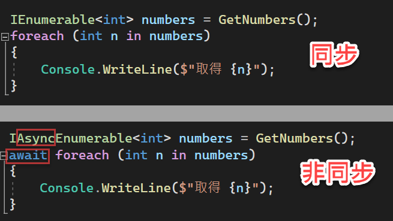
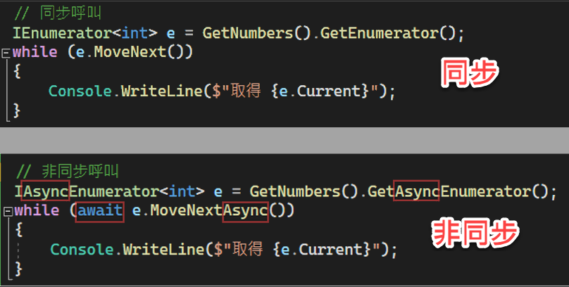

# C# 8

本章要介紹的是 C# 8 的新增語法和改進之處，包括：

- [索引與範圍](#索引與範圍)
- [Null 聯合指派運算子](#Null-聯合指派運算子)
- [簡化的 using 陳述式](#簡化的-using-陳述式)
- [靜態區域函式](#靜態區域函式)
- [Switch 表達式](#Switch-表達式)
- [Tuple 樣式、位置樣式、屬性樣式](#Tuple-樣式位置樣式屬性樣式)
- [結構成員可宣告唯讀](#結構成員可宣告唯讀)
- [預設介面實作](#預設介面實作)
- [可為 Null 的參考型別](#可為-Null-的參考型別)
- [非同步串流](#非同步串流)
---

## 索引與範圍

C# 8 新增的索引與範圍語法是用於存取陣列中的元素，包括 `String` 或者更低階的型別如 `Span<T>` 和 `ReadOnlySpan<T>`。

新增的索引語法可以讓我們指定要從陣列的「倒數第幾個元素」開始，以及到哪個地方停止。倒數第幾個元素的寫法是以 `^` 符號後面接著以 1 為開始的倒數序號。例如 `^1` 表示倒數第一個元素，`^2` 表示倒數第二個元素，依此類推。參考以下範例：

~~~~~~~~
char[] alphabets = new char[] {'A','B','C','D','E'};
char lastChar = alphabets[^1]; // 'E'
char lastSecond = alphabets[^2]; // 'D'
char outOfBound = alphabets[^0]; // 可編譯，但執行時會出錯!
~~~~~~~~

範圍語法則可以取得陣列的「切片」，使用的符號是連續兩個小數點，即 `..`。符號的左右兩邊可以指定起始索引和終止索引（其中一邊可以不指定）。範例：

~~~~~~~~
char[] slice1 = alphabets[..2];   // 'A', 'B'
char[] slice2 = alphabets[2..];   // 'C', 'D', 'E'
char[] slice3 = alphabets[2..3];  // 'C'
char[] slice4 = alphabets[^2..];  // 'D', 'E'
char[] slice5 = alphabets[0..^0]; // 整個範圍
~~~~~~~~

從 `slice1` 和 `slice3` 可以看得出來，**切片的結果並未包含範圍的終止索引所在的元素**。即 `[..2]` 代表從第 0 個元素開始，取至第 1 個元素；而 `[2..3]` 代表從第 2 個元素開始，取至第 2 個元素。

注意 `slice5` 的寫法是沒問題的。`^0` 雖然不能用來取得陣列中的最後一個元素，卻可以用於指定範圍的終止索引。正如前面所說，範圍切片並不包含終止索引。

> 試試看：https://dotnetfiddle.net/Hz1HxF

剛才介紹的索引和範圍語法，背後憑藉的是 `System.Index` 和 `System.Range` 類別。我們也可以在程式中使用這兩個類別來表示索引和範圍，例如：

~~~~~~~~
Index lastChar = ^1;  // 設定索引：倒數第一個元素
Range range = 0..2;   // 設定範圍：前兩個元素
char[] firstTwo = alphabets[firstTwo]; // 'A', 'B'
~~~~~~~~

> 試試看：https://dotnetfiddle.net/y0sqK3

我們也可以在自己的類別中透過 `Index` 和 `Range` 類別來設計索引子：

~~~~~~~~
class TrueLove
{
    string[] words = "True love never runs smooth".Split();
    
    public string this[Index index] => words[index];
    public string[] this[Range range] => words[range];
}

public static void Main()
{
    var love = new TrueLove();		
    Console.WriteLine(love[^1]); // "Smooth"		
    Console.WriteLine(string.Join(" ", love[0..2])); // "True Love"
}
~~~~~~~~

> 試試看：https://dotnetfiddle.net/g2Dgwt

值得一提的是，一般的字串（`String`）以及 `Span<T>`、`ReadOnlySpan<T>` 類別都可使用索引和範圍，但 `List<A>` 只能使用索引，而不可指定範圍。

此外，經由前面的範例，我們知道單維度陣列可使用索引和範圍，但如果是多維度陣列，則又還有一些細節：規則的多維度陣列（矩陣）不支援索引和範圍語法，但是不規則多維陣列（陣列中還有陣列）則可。

底下是多維陣列（矩陣）的範例：

~~~~~~~~
int[,] matrix = new int[,]  
{ 
    { 1, 2, 3},
    { 4, 5, 6},
    { 7, 8, 9}
};

Console.WriteLine(matrix[0, 2]);  // "3"
Console.WriteLine(matrix[0, ^1]); // 編譯失敗！
~~~~~~~~

> 試試看：https://dotnetfiddle.net/zXefe6

底下則是不規則多維陣列的範例：

~~~~~~~~
var jagged = new int[3][]
{
    new int[10] { 0, 1, 2, 3, 4, 5, 6, 7, 8, 9 },
    new int[6] { 10, 11, 12, 13, 14, 15 },
    new int[3] { 16, 17, 18 }
};

var selectedRows = jagged[0..2];

foreach (var row in selectedRows)
{
    var selectedColumns = row[^2..];
    foreach (var cell in selectedColumns)
    {
        Console.Write($"{cell}, ");
    }
    Console.WriteLine();
}	
~~~~~~~~

執行結果：

~~~~~~~~
8, 9, 
14, 15, 
~~~~~~~~

> 試試看：https://dotnetfiddle.net/i6n6Z1

## Null 聯合指派運算子

Null 聯合指派運算子的符號是兩個問號跟著一個等號，即 `??=`。意思是：「如果左邊的運算元是 null，就把右邊的運算元指派給左邊的運算元。」

以往類似底下的寫法：

~~~~~~~~
if (fontName == null)
{
    fontName = "新細明體"; // 指派預設值
}
~~~~~~~~

現在可以簡化成一行：

~~~~~~~~
fontName ??= "新細明體";
~~~~~~~~

## 簡化的 using 陳述式

C# 8 之前：

~~~~~~~~
if (File.Exists("readme.txt"))
{
    using var reader = File.OpenText("readme.txt")
    {
        Console.WriteLine(reader.ReadToEnd());
    }
}
~~~~~~~~

C# 8 開始可以減少一對大括號和一層縮排的空間：

~~~~~~~~
if (File.Exists("file.txt"))
{
    using var reader = File.OpenText("file.txt");
    Console.WriteLine(reader.ReadToEnd());
}
~~~~~~~~

以上兩種寫法的效果完全相同：當程式跑完 `if` 區塊之後，`reader` 物件就會被釋放（disposed）。

## 靜態區域函式

一般的區域函式能夠存取（捕捉）其外層區塊的變數和物件成員，如以下範例：

~~~~~~~~
public string GetName()
{
    string firstName = "Adam";
    string lastName = "Kay";

    return LocalGetName();

    string LocalGetName()
    {
        return $"{firstName} {lastName}";
    }
}
~~~~~~~~

C# 8 開始可以讓我們在區域函式前面加上 `static` 修飾詞，以確保該「靜態區域函式」無法存取外層區塊的變數和物件成員。如果把上面範例中的 `LocalGetName` 函式前面加上 `static` 宣告，變成：

~~~~~~~~
    static string LocalGetName()
    {
        return $"{firstName} {lastName}"; // 編譯失敗!
    }
~~~~~~~~

編譯會失敗，因為無法抓到外層變數 `firstName` 和 `lastName`。這種靜態區域函式的用處在於，有時候區域函式本身也會宣告一些暫時性的區域變數，而這些變數有可能跟外層函式的區域變數名稱相同，或者跟類別的欄位名稱相同，容易造成混淆、不易解讀，甚至產生 bugs。就像底下的範例：

~~~~~~~~
public string GetName()
{
    string firstName = "Adam";
    string lastName = "Kay";

    return LocalGetName();

    string LocalGetName()
    {
        string firstName = "John";

        return $"{firstName} {lastName}";
    }
}
~~~~~~~~

此範例程式可以通過編譯，但程式的意圖與執行結果則引人猜疑，原因就在於區域函式裡面也宣告了自己的 `firstName` 變數，但 `lastName` 卻是外層函式的變數。像這種可能產生混淆的情形，便可以宣告成靜態區域函式，明確限定其變數範圍。

## Switch 表達式

底下是 `switch` 陳述式（statement）的範例：

~~~~~~~~
string GetName(int id)
{
    string name = "未選擇";

    switch (id)
    {
        case 1: name = "台北市";
                break;
        case 2: name = "高雄市";
                break;
        default:break;
    }
    return name;
}
~~~~~~~~

C# 8 開始提供了 `switch` 表達式（expression，或譯作「運算式」），可將剛才的範例改寫成：

~~~~~~~~
string GetName(int id)
{
    string name = id switch
    {
        1 => "台北市",
        2 => "高雄市",
        _ => "未選擇"  // 預設值
    };
    return name;
}
~~~~~~~~

注意 `switch` 關鍵字是寫在變數的後面，這是和 `swicth` 陳述式的第一個明顯差異。其次，比對時不需要寫 `case` 和 `break`，而是在比對數值的後面跟著一個等號和大於符號，即 `=>`。第三個差異是預設值的寫法：`default` 變成了一個底線字元 `_`。整體而言，程式碼比 `switch` 陳述式更簡潔。

另外要注意的是，如果沒有寫 `_` 來指定預設值，可通過編譯，但編譯器會顯示警告。若程式執行時沒有任何匹配項目，也沒有提供預設值，則會拋出例外。

匹配的對象不僅可以是單一變數值，還可以是 `tuple`。參考以下範例：

~~~~~~~~
string GetName(int id, string postCode)
{
    string name = (id, postCode) switch
    {
        (1, "100") => "台北市中正區",
        (2, "802") => "高雄市苓雅區",
        _ => "未選擇"
    };

    return name;
}
~~~~~~~~

寫法相當直觀，這裡就不多做解釋了。

## Tuple 樣式、位置樣式、屬性樣式

「樣式比對」語法是從 C# 7 就開始提供，而 C# 8 增加了三種新樣式，主要用於 `switch` 陳述式或表達式（二者差異請看上一節的說明）。這三種新樣式為：**Tuple 樣式**、**位置樣式**（positional pattern）、**屬性樣式**（property pattern）。

上一節的範例程式已經展示了 Tuple 樣式的用法，方便閱讀起見，這裡再貼一次關鍵程式碼：

~~~~~~~~
string name = (id, postCode) switch
{
    (1, "100") => "台北市中正區",
    (2, "802") => "高雄市苓雅區",
    _ => "未選擇" 
};
~~~~~~~~

此處倒數第 2 行用來表示預設值的底線字元也可以寫成 `(_, _)`。

第二種樣式為屬性樣式（property pattern），可用來比對某物件的屬性，例如：

~~~~~~~~
string GetName(Address addr)
{
    return addr switch
    {
        { PostCode: "100" } => "台北市中正區",
        { PostCode: "802" } => "高雄市苓雅區",
        _ => "未選擇"
    };
}
~~~~~~~~

其中 `Address` 類別包含地址資訊，其 `PostCode` 屬性則是郵遞區號。以上範例所展示的是比對地址資訊中的郵遞區號，若有符合者，即回傳對應的行政區名稱。

如果地址有區分台灣地址和美國地址，分別實作成 `TWAddress` 和 `USAddress` 類別，那麼前述範例還可以加上型別研判，像這樣：

~~~~~~~~
return addr switch
{
    TWAddress { PostCode: "100" }   => "台北市中正區",
    USAddress { PostCode: "10025" } => "New York",
    USAddress                       => "Unknown",
    _ => "無效的郵遞區號!"
};
~~~~~~~~

說明：

- 第一個比對條件會先測試 `addr` 的型別是否為 `TWAddress`，如果是的話，再比對 `PostCode` 屬性值是否符合。
- 第二個比對條件在測試型別的時候換成了 `USAddress`，同時也有比對 `PostCode` 屬性。
- 第三個比對條件只要求型別是 `USAddress`。
- 第四個是預設值。

> 試試看：https://dotnetfiddle.net/sGYazD

上面範例的第一個比條件如果用 `if` 陳述式來寫，會像這樣：

~~~~~~~~
if (addr1 is TWAddress { PostCode: "100" })
{
    ...
}
~~~~~~~~

底下這行程式碼則可以用來判斷某物件是否為 `string`，而且字串長度為 4：

~~~~~~~~
if (obj is string { Length: 4 }) ...
~~~~~~~~

最後要說明的是位置樣式（positional pattern）。

先來看一個 `switch` 陳述式的範例：

~~~~~~~~
// 此範例無法通過編譯!
switch (point) 
{
    case (0, 0): return "原點";
    case (0, _): return "在垂直線上";
    case (_, 0): return "在水平線上";
    default: return "位置不重要";
}
~~~~~~~~

暫且假設 `point` 是一個包含 X、Y 座標的 `System.Drawing.Point` 結構。第一個 `case` 要求座標 X 和 Y 都必須是 0，第二個 `case` 則只要求 X 座標為 0，Y 座標可以是任意值，第三個 `case` 則只要求 Y 座標為 0，X 座標可為任意值。這三個 `case` 條件都使用了**位置樣式**來比對座標。

然而，上述範例無法通過編譯；編譯器會指出錯誤：`Point` 結構並未提供 `Deconstruct` 方法。這是因為，位置樣式需要搭配具有分解式（deconstructor）的物件來使用，亦即物件必須有 `Deconstruct` 方法。

> 註：tuple 沒有 `Deconstruct` 方法，但可以使用位置樣式來比對，是因為編譯器能夠認得 tuple 物件並拆解它們。說得更具體些，編譯器如果發現欲比對的物件沒有 `Deconstruct` 方法，接著就會看看該物件是否是個 tuple（有沒有實作 `ITuple` 介面），如果是的話，便會比對元素數量以及元素值。

如果使用以下自行定義的 `Point` 結構，則前述範例可以通過編譯：

~~~~~~~~
public readonly struct Point
{
    public int X { get; }
    public int Y { get; }
    public Point(int x, int y)
    {
        X = x;
        Y = y;
    }

    public void Deconstruct(out int x, out int y)
    {
        x = X;
        y = Y;
    }
}
~~~~~~~~

稍早介紹過 `switch` 表達式，這裡順便再複習一次，把剛才的 `switch` 陳述式範例改成 `switch` 表達式：

~~~~~~~~
return point switch 
{
    (0, 0) => "原點",
    (0, _) => "在垂直線上",
    (_, 0) => "在水平線上",
    _ =>  "位置不重要"
};	
~~~~~~~~

> 試試看：https://dotnetfiddle.net/hzUK68

## 結構成員可宣告唯讀

C# 8 開始可為結構的個別成員加上 `readonly` 修飾詞，藉以明確告訴編譯器：這是個唯讀的屬性或方法，亦即它不會改變物件的狀態。若不小心在某個宣告唯讀的函式中修改了物件的狀態，編譯器會立刻指出來。另一方面，我們只要看到某個方法前面有加上 `readonly`，就可以確定那個方法是絕對不會改變物件狀態的，這對我們日後閱讀與維護程式碼都有一些幫助。

> 除了閱讀本章，還有一個不錯的選擇是微軟的線上文件：〈[C# 8.0 的新功能](https://docs.microsoft.com/zh-tw/dotnet/csharp/whats-new/csharp-8)〉。其實，我在寫作時也有參考微軟線上文件與其範例，看到不錯的，便直接「借來用」，例如接下來的範例。

範例：

~~~~~~~~
public struct MyData
{
    public int Counter;

    public readonly int Increase => Counter + 1; // OK
    public readonly void Reset() => Counter = 0; // 編譯錯誤!
}
~~~~~~~~

第 5 行的 `Increase` 屬性只是傳回 `Counter` 加 1 的結果，而並未改變 `Counter`，也就是沒有改變物件的狀態，的確是唯讀操作。但下一行的 `Reset` 方法卻會把 `Counter` 改為 0，這就不符合 `readonly` 函式的要件，無法通過編譯。

接著來看一個比較微妙、需要我們特別留意的狀況：防禦複製（defensive copy）。延續剛才的範例，稍加修改：

~~~~~~~~
public struct MyData
{
    public int Counter;

    public int Increase => Counter++;
    public string IncreaseStr() => Increase.ToString();
}
~~~~~~~~

現在，`MyData` 結構中沒有任何唯讀方法，編譯也都沒問題。如果呼叫端有底下這樣一段程式碼：

~~~~~~~~
var d = new MyData();
Console.WriteLine(d.IncreaseStr()); // "0"
Console.WriteLine(d.IncreaseStr()); // "1"
~~~~~~~~

顯而易見，第 2 行程式碼的輸出結果是 "0"，第 3 行則是輸出 "1"。這是因為 `IncreaseStr` 方法使用了 `Increase` 屬性，而 `Increase` 屬性在回傳當前的 `Counter` 數值後，會把 `Counter` 內容加 1。

現在嘗試把 `IncreaseStr` 方法加上 `readonly` 看看：

~~~~~~~~
public struct MyData
{
    public int Counter;

    public int Increase => Counter++;
    public readonly string IncreaseStr() => Increase.ToString();
}
~~~~~~~~

然後再執行一遍剛才的呼叫端程式碼，結果這次會輸出兩個 "0"。為什麼呢？

修改後的程式碼，雖然可以通過編譯，但是在倒數第 2 行卻會出現編譯警告：

> Warning CS8656: Call to non-readonly member 'MyData.Increase.get' from a 'readonly' member results in an implicit copy of 'this'.	

意思是：唯讀方法（即此例的 `IncreaseStr`）裡面有去用到非唯讀的方法，對這種情況，編譯器無法判斷那些後續呼叫的非唯讀方法究竟會不會修改物件本身的狀態，故為了確保當下這個唯讀方法符合其 `readonly` 宣告的行為，編譯器在這裡會自動安插一個複製動作：把當前物件複製出一個分身，然後用那個分身來執行後續操作。因此，當呼叫端對同一個物件呼叫兩次 `IncreaseStr` 方法，即使每一次呼叫都有遞增 `Counter`，但其改變僅發生在「分身」，而不會去動到原有物件的狀態。這種由編譯器自動加入的複製物件行為，即所謂的防禦複製（defensive copy），目的是為了保證  `readonly` 方法的行為符合預期，亦即不會改變物件本身的狀態。

## 預設介面實作

預設介面實作（default interface implementation）是 C# 8 的新功能，它能夠讓你在介面中加入一些預設實作，包括方法、屬性、靜態欄位、巢狀型別等等。

那麼，C# 為什麼要增加這個語法呢？

我們知道，類別在實作某個介面的時候，一定要實作該介面所定義的所有成員。試著想像 C# 8.0 之前，也就是還沒有預設介面實作的時代，你設計的某個介面一旦對外公開了、有其他類別開始實作那個介面了，那麼介面就不可再更改 ——你不能修改既有的介面方法與屬性，也不能在那個介面中添加任何新的方法或屬性，否則原先已經實作該介面的類別便無法通過編譯（因為缺少了部分成員的實作）。這也是為什麼我們以前常聽到的一個原則：介面一旦公開了，就不可再修改。這形成了一種限制，導致介面的僵化，無法隨著時代和需求持續演進。

現在，C# 8 的預設介面實作放寬了上述限制，讓我們能夠對既有的介面添加新的成員。先來看一個簡單的例子：

~~~~~~~~
public interface ILogger
{
    void Log(string msg);
}
~~~~~~~~

如果某個類別要實作 `ILogger`，它就必須提供 `Log` 方法的實作：

~~~~~~~~
public class Logger
{
    void Log(string msg) 
    { 
        Console.WriteLine(msg); 
    }
}
~~~~~~~~

到目前為止，一切都沒問題，直到你想要在 `ILogger` 中增加新成員。此時，C# 8 的預設介面實作便可派上用場。假設你想要新增一個 `Error` 方法，便可以這樣寫：

~~~~~~~~
public interface ILogger
{
    // 這是原本我們熟悉的、沒有實作的介面方法。
    void Log(string msg); 
    
    // 此方法提供了預設實作。C# 8 以後才能這樣寫。
    void Error(Exception ex) 
    { 
        Console.WriteLine(ex); 
    }
}
~~~~~~~~

底下是用戶端的部分，跟以前的寫法完全一樣：

~~~~~~~~
ILogger logger1 = new Foo();
logger1.Error("....");

~~~~~~~~

注意不能這樣寫：

~~~~~~~~
Logger logger2 = new Logger();
logger2.Error(exception);  // 編譯錯誤!
~~~~~~~~

編譯錯誤的原因是，預設方法 `Error` 只存在介面裡，而不會被類別 `Logger` 繼承下來。

除了提昇介面的向後相容能力（backward compatibility），「預設介面實作」也帶來了更多新語法，例如在介面中定義常數、靜態欄位、巢狀型別等等。參考以下範例：

~~~~~~~~
public interface ILogger
{
    void Log(string msg)     
    
    // 預設實作。
    void Error(Exception ex);
    { 
        // 保存或輸出錯誤訊息。
    }

    // 巢狀型別
    enum LogLevel
    {
        Debug,
        Information,
        Warning,
        Error,
    };
	
    // 使用了巢狀型別的屬性
    LogLevel Level { get; set; } 

    // 靜態成員
    static ILogger DefaultLogger;
}
~~~~~~~~

實作 `ILogger` 的類別，必須提供 `Log` 方法，至於 `Error` 方法則可有可無，原因正如前面提過的，介面本身已經提供 `Error` 方法的預設實作。參考以下範例：

~~~~~~~~
public class Logger : ILogger
{
    public ILogger.LogLevel Level { get; set; } = ILogger.LogLevel.Debug;

    public void Log(string msg)
    {
        Console.WriteLine(msg);
    }	
}   
~~~~~~~~

另外也值得留意的是第 3 行使用了巢狀型別 `ILogger.LogLevel` 來定義屬性和設定初始值。

這些介面成員也都可以加上存取範圍修飾詞，如上例的巢狀型別，你可以根據實際需要來決定是否替它加上 `private`、`protected`、或 `public` 修飾詞（介面中的成員預設為 public）。

## 可為 Null 的參考型別

對於熟悉 C# v1 至 v7.x 的人來說，初次聽到「可為 null 的參考型別」（Nullable Reference Types）可能會覺得奇怪：宣告為參考型別的變數不是本來就可以為 null 嗎？而且如果沒有給值，其預設值就是 null（未指向任何物件）。為什麼還要特別強調「可為 null 的參考」呢？

在 C# 8.0 之前，由於參考型別的變數預設可為 null，而且在執行時期隨時都有可能為 null，所以我們以往在寫 C# 程式的時候，經常得在程式各處寫一些安全防護的程式碼：如果某變數不是 null 才繼續做某件事。例如：

~~~~~~~~
static int StrLen(string text)
{
    return text == null? 0 : text.Length;
}
~~~~~~~~

就上例來說，我們在寫 `StrLen` 函式時，並沒有辦法確定傳入的參數 `text` 究竟有沒有值；如果不先檢查變數是否為 null 就使用它的屬性或方法，那麼當程式執行時，只要呼叫端傳入 null，就會引發 `NullReferenceException` 類型的錯誤。

然而，變數為 null 的情形可能到處都是，防不勝防，如果在編譯時期就能盡量避免這類潛在問題，應用程式必然更加穩固，開發人員也能少寫一些重複瑣碎的程式碼，如此不僅減輕了人的負擔，程式碼也更簡潔、更能明白呈現程式碼的意圖。這便是 C# 8 加入 Nullable References 的主要原因。

 一旦你決定在程式中使用 C# 8 的這項新功能，在宣告參考型別的變數時，若允許它為 null，則必須在型別後面附加一個問號（`?`）。請看底下這個簡單的範例：

~~~~~~~~
string str1 = "hello"; // str1 是不可為 null 的字串
string? str2 = null;   // str2 是可為 null 的字串
~~~~~~~~

你會發現，原本常用的語法（上面範例的第一行），在加入 Nullable Reference Types 功能之後被賦予了新的意義；換言之，以往的參考型別是預設可為 null，現在變成預設不可為 null 了。就語意而言，這是蠻大的改變，而且必然對既有的程式碼帶來不少衝擊，故在預設情況下，Nullable Reference Types 功能是關閉的。

> 為了方便說明與閱讀，有時我會使用比較簡短的英文「Nullable References」來代表 Nullable Reference Types。

### 開啟 Nullable Reference Types 功能

讓我們先試試看，在使用 C# 8 來編譯程式的情況下，不做任何額外設定，以下程式碼能夠通過編譯嗎？

~~~~~~~~
string? str2 = null;  // str2 是可為 null 的字串
~~~~~~~~

可以通過編譯，但是伴隨警告：

> CS8632: The annotation for nullable reference types should only be used in code within a '#nullable' annotations context.

這是因為，如前面提過的，由於 C# 8 的 Nullable Reference Types 是重大改變，對開發人員和既有程式碼都會產生不少衝擊，所以此功能預設是關閉的。當我們想要使用「可為 null 的參考型別」時，就必須明白指示編譯器要開啟這項功能。

為了讓開發人員能夠更彈性地應付各種狀況，C# 提供了兩種面向的控制開關：

- **nullable annotation context**：是否啟用 Nullable References 語法。（註：多數文件把 annotation 翻譯為「注釋」，而我選擇把 annotation 稱作「語法」，主要是方便理解。）
- **nullable warning context**：是否啟用 Nullable References 相關的編譯警告。

為什麼這兩種開關都以「context」（環境、上下文）來命名呢？我想這大概是因為 C# 可以讓我們針對任意範圍的（甚至只有一行）程式碼來控制與 Nullable References 語法有關的編譯行為。

再重複一次：預設情況下，Nullable References 語法和編譯警告都是關閉的（disabled）。也就是說，即使不修改任何程式碼，你的既有 C# 專案也能跟以往一樣順利通過編譯，而且不會出現與 Nullable References 有關的警告訊息。

接著來看看如何控制這些開關。

### 在個別檔案中使用 #nullable 指示詞

你可以在程式碼的任何地方使用 `#nullable` 指示詞來啟用或關閉 Nullable References 語法或警告（即剛才提過的 `annotation context` 和 `warning context`）。例如，在一個 C# 程式檔案的最上方或者 `using` 陳述式下方加入一行 `#nullable enable`，這表示整個檔案裏面的程式碼都會啟用 Nullable References 語法。

你也可以只對局部程式碼區塊啟用 Nullable References 語法，作法是在需要啟用新語法的地方加上 `#nullable enable`，然後在不需要此語法的地方加上 `#nullable disable`，或者使用 `#nullable restore` 來回復至專案層級的設定（稍後會介紹）。參考以下範例：

~~~~~~~~
#nullable enable    // 啟用 nullable 語法和警告
    string? str1 = null;
#nullable disable   // 關閉 nullable 語法和警告
    string str2 = null;
~~~~~~~~

上列程式碼可以順利通過編譯，而且沒有任何警告訊息。其中 str1 是可為 null 的字串，而 str2 也是可為 null 的字串；差別只在於前者使用的是 C# 8 的 Nullable Refernce Types 語法，後者則為舊版 C# 語法。如果把這兩行程式碼對調，則會各自引發編譯警告：

~~~~~~~~
#nullable enable    
    string str1 = null;   // 編譯警告 CS8600
#nullable disable   
    string? str2 = null;  // 編譯警告 CS8632
~~~~~~~~

編譯警告 CS8600 的訊息是：

> 中文：正在將 Null 常值或可能的 Null 值轉換為不可為 Null 的型別。
> 
> 英文：Converting null literal or possible null value to non-nullable type.

編譯警告 CS8632 的內容是：

> 中文：可為 Null 的參考型別註釋應只用於 '#nullable' 註釋內容中的程式碼。
> 
> 英文：The annotation for nullable reference types should only be used in code within a '#nullable' annotations context.

經過前面的說明，相信你應該已經能夠理解為什麼那兩行程式碼會出現編譯警告了。

底下列出 #nullable 指示詞的各種控制組合：

- `#nullable disable`：關閉 nullable 語法和編譯警告。（這是預設情形）
- `#nullable enable`：開啟 nullable 語法和編譯警告。
- `#nullable restore`：從這裡開始套用專案層級的 nullable 設定。
- `#nullable disable annotations`：關閉 nullable 語法。
- `#nullable enable annotations`：開啟 nullable 語法。
- `#nullable restore annotations`：從這裡開始套用專案層級的 nullable 語法開關。
- `#nullable disable warnings`：關閉 nullable 相關的編譯警告。
- `#nullable enable warnings`：開啟 nullable 相關的編譯警告。
- `#nullable restore warnings`：從這裡開始套用專案層級的 nullable 編譯警告開關。

有了這些控制開關，你就可以採取循序漸進的方式來把既有的 C# 專案逐漸修改成 C# 8 的 Nullable References 語法。比如說，先針對少數幾個檔案加入 `#nullable enable`，感受一下啟用新語法之後，要花多少工夫來修改程式碼，才能消除所有的編譯警告。等到熟練了，覺得更有把握了，再把修改範圍擴及更多 C# 程式檔案。

### 專案與方案層級的設定

除了檔案層級的 `#nullable` 指示詞，你也可以在 .csproj 檔案裡面加入 `<Nullable>enable</Nullable>` 來讓整個專案都啟用 Nullable References 語法。如下所示（第 5 行）：

~~~~~~~~
<Project Sdk="Microsoft.NET.Sdk">
  <PropertyGroup>
    <OutputType>Exe</OutputType>
    <TargetFramework>netcoreapp3.1</TargetFramework>
    <Nullable>enable</Nullable>
  </PropertyGroup>
</Project>
~~~~~~~~

與 `#nullable` 指示詞類似，`<Nullable>` 元素除了指定為 `enable` 之外，你也可以在這裡使用 `disable`、 `warnings`、`annotations`。

你甚至可以把控制範圍擴及整個方案（solution），作法是在方案的根目錄下建立一個名為 Directory.Build.props 的檔案，內容則和 .csproj 裡面的寫法一樣。參考底下的範例：

~~~~~~~~
<Project>
 <PropertyGroup>
    <Nullable>enable</Nullable>
    <RunAnalyzersDuringBuild>true</RunAnalyzersDuringBuild>
    <RunAnalyzersDuringLiveAnalysis>true</RunAnalyzersDuringLiveAnalysis>
 </PropertyGroup>
</Project>
~~~~~~~~

> **Nullable References 語法的編譯警告列表**
>
> 如果你想要知道 C# 編譯器在檢查 Nullable References 語法時的規則與警告訊息，可以參考這個頁面：[CsharpNullableTypeRules.md](https://gist.github.com/huanlin/e6aebce9d13340a94ba7a6868e5c790c)。這是利用 [Cezary Piątek 提供的程式碼](https://gist.github.com/cezarypiatek/73bc42beda006bf7890d9ccc7263da03)所產生的結果，我只是把程式裡面的 "en-US" 改為 "zh-TW" 而已。
> 
> 如果你想要更進一步全面採用 Nullable References 語法，可以考慮使用 [EditorConfig 檔案](https://docs.microsoft.com/zh-tw/visualstudio/ide/create-portable-custom-editor-options)來把相關編譯警告提升至「錯誤」等級。

## 非同步串流

C# 不是已經有 `async` 和 `await` 語法可實現非同步呼叫嗎？為什麼還需要非同步串流（async streams）呢？

在需要處理大量資料的場合，假設我們在程式中透過非同步方式來呼叫其他 API（例如 Web API、資料查詢 API 等等）來獲取資料，好讓用戶端在我們的程式等待其他 API 回傳資料的過程中還能繼續做其他事情，不至於完全卡住使用者介面。剛才說的那些 API 所回傳的資料類型通常是 `IEnumerable<T>`，然而，`IEnumerable<T>` 的運作方式是同步的（synchronous）。意思是，在拉取資料的場合，用戶端必須等到資料提供端回傳所有需要之資料，才能對那些資料進行後續處理（例如顯示在網頁上）。也就是說，雖然非同步呼叫可以讓使用者繼續動動滑鼠、敲敲鍵盤，但沒辦法讓她想看到的資料盡快出現。

想像一下，你正在開發一個線上購物網站，當使用者在瀏覽商品清單頁面時，拚命地快速往下滑（快速跳下一頁），此時你的網站應用程式會收到許多抓取資料的請求。假設使用者每次往下跳一頁需要抓取 50 筆資料，那麼當使用者連續快速跳下一頁，雖然她的鍵盤與滑鼠都還可以繼續操作，但終究還是得等到所有該抓的資料全部取得之後，才有辦法看到她想看的東西。換言之，無論我們的網站後端程式有沒有在背後使用 `async` 語法，使用者需要等待的時間幾乎是一樣的，因為她此時的目的只有一個：盡快看到她想看的資料，而不是在查詢資料時還去點其他按鈕或連結。

那麼，我們是否能在拉取資料時，讓使用者先看到一部份結果？也就是說，一邊抓取資料的同時就一邊回傳當下已經獲取的部分資料——就算只先出現 10 筆資料也好，而不要等到整頁（例如 50 筆）資料全都拉回來之後才一次全部顯示。這就是非同步串流（async streams）能夠派上用場的地方。

### `IEnumerable<T>` 與 `yield return`

欲了解 C# 非同步串流的運作機制與寫法，至少必須提到兩個 .NET 基礎類別：`IEnumerble<T>` 和 `IAsyncEnumerable<T>`，同時也得了解 C# 的 `yield return` 用法。首先讓我們來看一下 `IEnumerble<T>` 與 `yield return` 的範例：

~~~~~~~~
IEnumerable<int> numbers = GetNumbers();
foreach (int n in numbers)
{
    Console.WriteLine($"取得 {n}");
}

IEnumerable<int> GetNumbers()
{
    var numbers = new int[] { 1, 2, 3 };
    foreach (int n in numbers)
    { 
        yield return n;
        Console.WriteLine($"回傳 {n} 之後");
    }
}
~~~~~~~~

此範例的功能很單純，只是呼叫 `GetNumbers` 函式來取得一串整數，然後用一個迴圈把數字輸出至螢幕。執行結果如下：

~~~~~~~~
取得 1
回傳 1 之後
取得 2
回傳 2 之後
取得 3
回傳 3 之後
~~~~~~~~

觀察重點是程式執行的流程：由於使用了 `yield return`，使得 `GetNumbers` 函式的執行流程被切成三段（因為回傳的串列元素總數為 3）。

> 試試看：https://dotnetfiddle.net/Kj1SSA

底下說明程式執行的過程（讀起來可能有點燒腦）：

1. 第 1 行呼叫 `GetNumebers` 方法，看似已經立刻取得一個完整的整數串列，但實際上並非如此。若以單步追蹤的方式來逐步執行，第 1 行程式碼跑完後，螢幕上並沒有輸出任何文字。
2. 進入第 2 行的 `foreach` 迴圈，從 `numbers` 串列中取出第一個元素時，此時才會真正進入 `GetNumbers` 方法，並且依序執行第 9～12 行程式碼。第 12 行程式碼的 `yield return` 會立即返回當前的元素（整數 1），然後程式流程立刻回到呼叫端（即第 4 行）繼續執行，於是在螢幕上輸出字串：「取得 1」。
3. 接下來，第 2 行的 `foreach` 進入第二圈，欲取出 `numbers` 串列的第二個元素，此時程式流程會**跳回上一次 `yield return` 敘述的下面接著執行**，於是印出字串：「回傳 1 之後」。接著會跑 `GetNumbers` 函式中的第二圈，再次碰到 `yield return`，於是回傳當前的元素（整數 2），程式流程立刻回到呼叫端（即第 4 行）繼續執行，於是在螢幕上輸出字串：「取得 2」。
4. 跟上一個步驟所描述的流程相同，這次回傳的元素是整數 3。

像這樣跳來跳去的執行流程，是不是有點像 `async` 呼叫？（但不是）

值得一提的是，`GetNumbers` 函式雖然反覆進入多次，但第 9 行用來初始化整數陣列的程式碼只會執行一次。換言之，`GetNumbers` 函式宛如一個狀態機（state machine），能夠記住自身的狀態。這是 `yield return` 產生的效果。

如果你對這個範例的執行過程還有些疑問，不妨動手修改一下程式碼來實驗看看。比如說，`yield return` 不是一定要寫在迴圈裡面，你也可以把 `GetNumbers` 方法改寫成這樣：

~~~~~~~~
IEnumerable<int> GetNumbers()
{
    yield return 1;
    Console.WriteLine($"回傳 1 之後");
    yield return 2;
    Console.WriteLine($"回傳 2 之後");
    yield return 3;
    Console.WriteLine($"回傳 3 之後");
}
~~~~~~~~

執行結果跟先前的寫法一樣。

另一方面，呼叫端的 `foreach` 迴圈，骨子裡其實是用列舉器 `IEnumerator<T>` 的 `MoveNext` 方法來取得下一個元素，所以先前範例的 1～5 行也可以改寫成：

~~~~~~~~
IEnumerator<int> e = GetNumbers().GetEnumerator();
while (e.MoveNext())
{
    Console.WriteLine($"取得 {e.Current}");
}

// 底下是先前的寫法，一併列出來，方便對照。
IEnumerable<int> numbers = GetNumbers();
foreach (int n in numbers)
{
    Console.WriteLine($"取得 {n}");
}
~~~~~~~~

你可以把中斷點設在第 3 行（呼叫 `MoveNext` 方法處），然後以單步追蹤來觀察程式的執行流程與結果，應該會發現跟原先的版本是一樣的。

### `IAsyncEnumerable<T>` 與 `await foreach`

剛才的範例程式雖然能夠一邊讀取串列元素，一邊立刻將取得之元素內容輸出至螢幕上，而且程式流程反覆跳來跳去，感覺有點像非同步呼叫，但並不是；剛才的範例都是同步呼叫。現在試著想像一下，`GetNumbers` 方法裡面會呼叫其他 Web API 或資料查詢函式，因而必須使用 `await` 來取得非同步工作的結果，像這樣：

~~~~~~~~
IEnumerable<int> GetNumbers()
{
    var numbers = await SomeApi.GetNumbersAsync();
    foreach (int n in numbers)
    { 
        yield return n;
        Console.WriteLine($"回傳 {n} 之後");
    }
}
~~~~~~~~

你可能已經發現上面的程式碼無法通過編譯，因為 C# 的非同步呼叫寫法要求函式當中如果有用到 `await`，該函式就必須加上 `async` 宣告，成為非同步方法。像這樣：

~~~~~~~~
async IEnumerable<int> GetNumbers()
{
    var numbers = await SomeApi.GetNumbersAsync();
    ... (略)
}
~~~~~~~~

但這樣還不夠，因為非同步方法的回傳型別必須是 `Task`、`Task<T>`、或者「具備 `Task` 性質的型別」，例如 `IAsyncEnumerable<T>`。繞了這麼一大圈，主角終於現身了。底下是非同步版本的 `GetNumbers` 的完整、正確寫法：

~~~~~~~~
async IAsyncIEnumerable<int> GetNumbers()
{
    var numbers = await SomeApi.GetNumbersAsync();
    foreach (int n in numbers)
    { 
        yield return n;
        Console.WriteLine($"回傳 {n} 之後");
    }
}
~~~~~~~~

有了 `IAsyncEnumerable<T>`，再搭配 C# 8 新增的 `async foreach` 語法，就可以讓我們更自然地寫出非同步串流的程式碼。底下是把稍早的同步呼叫的範例程式改寫成 async 版本：

~~~~~~~~
IAsyncEnumerable<int> numbers = GetNumbers();
await foreach (int n in numbers)
{
    Console.WriteLine($"取得 {n}");
}

async IAsyncEnumerable<int> GetNumbers()
{
    await Task.Delay(1000);
    yield return 1;
    await Task.Delay(1000);
    yield return 2;
    await Task.Delay(1000);
    yield return 3;
}
~~~~~~~~

你可以把 `GetNumbers` 函式裡面的 `await Task.Delay()` 假裝是某個 web API 呼叫或者某個非同步的資料查詢操作。

> 試試看：https://dotnetfiddle.net/lxc8Fx

呼叫端的部分，除了使用 `IAsyncEnumerable<T>` 取代同步版本的 `IEnumerable<T>`，另外就是 `foreach` 迴圈前面必須加上 `await` 關鍵字（第 2 行）。下圖同時呈現同步與非同步版本的呼叫端程式碼，方便對照差異：

使用 `await foreach` 迴圈來取得串列元素時，編譯器所產生的程式碼是使用非同步版本的列舉器 `IAsyncEnumerator<T>`，像這樣：

~~~~~~~~
IAsyncEnumerator<int> e = GetNumbers().GetAsyncEnumerator();
while (await e.MoveNextAsync())
{
    Console.WriteLine($"取得 {e.Current}");
}
~~~~~~~~

下圖可方便比對同步與非同步版本的寫法有何差異：

### 重點整理

最後整理 C# 非同步串流的幾個重點：

- 以往使用 `IEnumerable<T>` 來傳遞資料時，是以「同步」的方式運行。
- 支援非同步串流的函式，其回傳型別是 `IAsyncEnumerable<T>`，而不是 `IEnumerable<T>`。
- 可讓我們在同一個方法當中使用 `await` 來取得非同步工作的結果，並使用 `yield return` 來回傳當下已獲取之資料；即抓到一點就回傳一點，邊抓邊傳的模式。
- 用戶端程式在使用 `await foreach` 來逐一取得非同步串流的內容（元素）時，背後真正觸發其「抓取資料」動作的是 `IAsyncEnumerator<T>` 的 `MoveNextAsync` 方法。用白話來說就是：當用戶端需要下一筆資料，才立刻去抓那一筆資料。

💬 P.S. 本文提及「拉取資料」時，指的是 pull-based API，例如 `IEnumerable<T>`。沒有明確指出的是另一種 push-based API，例如 [`IObservable<T>`](https://docs.microsoft.com/zh-tw/dotnet/api/system.iobservable-1?view=net-6.0)。此外，本文也沒有介紹 `yield break` 和 [`IAsyncDisposable`](https://docs.microsoft.com/zh-tw/dotnet/api/system.iasyncdisposable?view=net-6.0)。

～END～

👉[返回首頁](https://github.com/huanlin/LearningNotes#readme)
